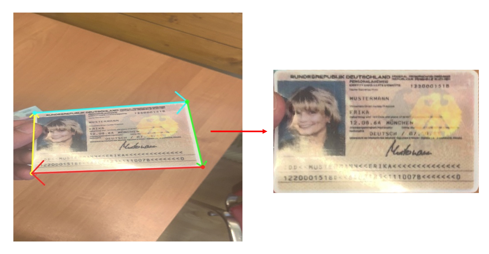
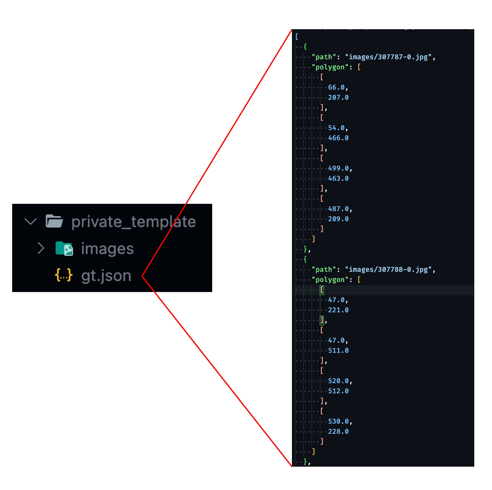

**[English](./README.md)** | [中文](./README_tw.md)

# DocAligner

<p align="left">
    <a href="./LICENSE"></a>
    <a href="https://github.com/DocsaidLab/DocAligner/releases"></a>
    <a href=""></a>
    <a href="https://doi.org/10.5281/zenodo.10442508"></a>
</p>

## Introduction

<div align="center">
    
</div>

This project aims to develop a visual system specifically for the precise localization of documents within images. Our primary goal is to accurately predict the positions of the four corners of a document. This technology is particularly applicable in industries such as fintech, banking, and the sharing economy, as it significantly reduces the error rate and computational demands of image processing and text analysis tasks.

The core functionality of this system is known as "Document Localization." Our models are specifically designed to identify documents in images and flatten them for subsequent text recognition or other processing tasks. We offer two different models: the "Heatmap Model" and the "Point Regression Model," each with its characteristics and suitable applications, which will be detailed in subsequent sections.

Technically, we have chosen PyTorch as our training framework and ONNXRuntime for model inference, enabling efficient operation of our models on both CPUs and GPUs. Additionally, we support converting our models into the ONNX format for convenient deployment on various platforms. For scenarios requiring quantization, we provide a static quantization model function based on the ONNXRuntime API.

Our models achieve near state-of-the-art (SoTA) performance and demonstrate real-time inference speeds in practical applications, meeting the needs of most usage scenarios.

## Table of Contents

- [Introduction](#introduction)
- [Table of Contents](#table-of-contents)
- [Quick Start](#quick-start)
- [Benchmark](#benchmark)
- [Dataset](#dataset)
- [Dataset Submission](#dataset-submission)
- [Frequently Asked Questions (FAQs)](#frequently-asked-questions-faqs)
- [Citation](#citation)

---

## Quick Start

### Installation

Currently, we do not offer an installation package on Pypi. To use this project, you can directly clone it from Github and then install the necessary dependencies. Before proceeding with the installation, please ensure that you have [DocsaidKit](https://github.com/DocsaidLab/DocsaidKit) installed.

If you have already installed DocsaidKit, follow these steps:

1. Clone the project:

   ```bash
   git clone https://github.com/DocsaidLab/DocAligner.git
   ```

2. Enter the project directory:

   ```bash
   cd DocAligner
   ```

3. Create a packaging file:

   ```bash
   python setup.py bdist_wheel
   ```

4. Install the packaging file:

   ```bash
   pip install dist/docaligner-*-py3-none-any.whl
   ```

By following these steps, you should be able to successfully install DocAligner.

Once the installation is complete, you can start using the project.

---

### Import Necessary Dependencies

We provide a simple model inference interface, which includes pre-processing and post-processing logic.

First, you need to import the required dependencies and create a DocAligner class.

```python
import docsaidkit as D
from docsaidkit import Backend
from docaligner import DocAligner, ModelType
```

### ModelType

`ModelType` is an enumeration type used to specify the model type for DocAligner. It includes the following options:

- `heatmap`: Uses a heatmap model for document alignment.
- `point`: Uses a point detection model for document alignment.

More model types may be added in the future, and we will update them here.

### Backend

`Backend` is an enumeration type used to specify the computational backend for DocAligner. It includes the following options:

- `cpu`: Uses the CPU for computations.
- `cuda`: Uses the GPU for computations (requires appropriate hardware support).

ONNXRuntime supports many backends, including CPU, CUDA, OpenCL, DirectX, TensorRT, etc. If you have other requirements, you can refer to [**ONNXRuntime Execution Providers**](https://onnxruntime.ai/docs/execution-providers/index.html) and modify it to the corresponding backend.

### Create a DocAligner Instance

```python
model = DocAligner(
    gpu_id=0,  # GPU ID, set to -1 if not using GPU
    backend=Backend.cpu,  # Choose the computational backend, can be Backend.cpu or Backend.cuda
    model_type=ModelType.point  # Choose the model type, can be ModelType.heatmap or ModelType.point
)
```

Note:

- Using the cuda backend requires not only appropriate hardware but also the installation of the corresponding CUDA drivers and toolkit. If CUDA is not installed in your system or the installed version is incorrect, the cuda backend will not be available.

- For issues related to ONNXRuntime installation dependencies, please refer to [ONNXRuntime Release Notes](https://onnxruntime.ai/docs/execution-providers/CUDA-ExecutionProvider.html#requirements).

### Read and Process Images

```python
# Read the image
img = D.imread('path/to/your/image.jpg')

# You can also use our test image
# img = D.imread('docs/run_test_card.jpg')

# Use the model for inference
result = model(img) # result is a Document type
```

### Output Results

The inference result you get is wrapped as a `Document` type, containing document polygons, OCR text information, etc.

In this module, we will not use OCR-related features, so we will only use the `image` and `doc_polygon` attributes. After obtaining the inference result, you can perform various post-processing operations.

#### Draw Document Polygon

```python
# Draw and save an image with the document polygon
result.draw_doc('path/to/save/folder', 'output_image.jpg')
```

Or if you don't specify a save path, it will be saved in the current directory with an automatically assigned timestamp.

```python
result.draw_doc()
```

#### Get the Drawn numpy Image

If you have other requirements, you can use the `gen_doc_info_image` method and then process it yourself.

```python
img = result.gen_doc_info_image()
```

#### Extract the Flattened Document Image

If you know the original size of the document, you can use the `gen_doc_flat_img` method to transform the document image into a rectangular image according to its polygonal boundary.

```python
H, W = 1080, 1920
flat_img = result.gen_doc_flat_img(image_size=(H, W))
```

For an unknown image type, you can also proceed without specifying the `image_size` parameter. In this case, the minimum rectangular image will be calculated based

 on the document polygon, and the length and width of the minimum rectangle will be set as `H` and `W`.

```python
flat_img = result.gen_doc_flat_img()
```

#### Convert Document Information to JSON

If you need to save document information to a JSON file, use the `be_jsonable` method.

When converting, consider excluding the image to save space, defaulting to `exclude_image=True`.

```python
doc_json = result.be_jsonable()
D.dump_json(doc_json)
```

#### Example

```python
import docsaidkit as D
from docaligner import DocAligner

model = DocAligner(D.Backend.cpu)
img = D.imread('docs/run_test_card.jpg')
result = model(img)

# You can draw the result by yourself.
output_img = D.draw_polygon(img, result.doc_polygon)
flat_img = result.gen_doc_flat_img(image_size=(480, 800))
D.imwrite(output_img)
D.imwrite(flat_img)

# Or you can draw the colorful image from `draw_doc` method.
# result.draw_doc()
```

<div align="center">
    
</div>

---

## Benchmark

We utilized the [SmartDoc 2015](https://github.com/jchazalon/smartdoc15-ch1-dataset) dataset as our test dataset.

### Evaluation Protocol

We used the **Jaccard Index** as our measurement standard. This index summarizes the ability of different methods in accurately segmenting page outlines and penalizes those methods that fail to detect document objects in certain frames.

The evaluation process starts by using the size and coordinates of documents in each frame to perform a perspective transformation on the quadrilateral coordinates of the submitted method S and the ground truth G, resulting in the corrected quadrilaterals S0 and G0. Such transformation makes all evaluation metrics comparable within the document reference frame. For each frame f, the Jaccard Index (JI) is calculated, which is a measure of the extent of overlap between the corrected quadrilaterals, calculated as follows:

$$ JI(f) = \frac{\text{area}(G0 \cap S0)}{\text{area}(G0 \cup S0)} $$

where $` \text{area}(G0 \cap S0) `$ is defined as the intersection polygon of the detected quadrilateral and the ground truth quadrilateral, and $` \text{area}(G0 \cup S0) `$ is their union polygon. The overall score for each method will be the average of scores for all frames in the test dataset.

### Performance Evaluation

We have provided a simple evaluation module that can be used to assess the model's performance on the SmartDoc2015 dataset.

Please ensure that you have downloaded the `SmartDoc2015` dataset and placed it in the `/data/Dataset` directory before running the evaluation. If the dataset is not in this directory, you can still proceed, but you will need to modify the path `-v /data/Dataset:/data/Dataset` in the `DocAligner/docker/benchmark.bash` script accordingly.

```bash
# The input content in order is:
# Target bash for execution, dataset name, model type, and model name.
bash DocAligner/docker/benchmark.bash smartdoc heatmap lcnet050
```

### Evaluation Results

<div align="center">

| Models | bg01 | bg02 | bg03 | bg04 | bg05 | Overall |
| :---: | :---: | :---: | :---: | :---: | :---: | :---: |
| HReg-FastViT_SA24-BiFPNx3-256 (Ours) |  0.9944 |  0.9932 |  0.9940 |  0.9937 |  0.9929 |  0.9937 |
| HReg-MBV2_100-BiFPNx3-256 (Ours) |  0.9917 |  0.9901 |  0.9921 |  0.9899 |  0.9891 |  0.9909 |
| HReg-FastViT_T8-BiFPNx3-256 (Ours) |  0.9920 |  0.9894 |  0.9918 |  0.9896 |  0.9888 |  0.9906 |
| HReg-LC100-BiFPNx3-256 (Ours) |  0.9908 |  0.9877 |  0.9905 |  0.9894 |  0.9854 |  0.9892 |
| HReg-LC100-FPNx3-256 (Ours) |  0.9899 |  0.9865 |  0.9912 |  0.9884 |  0.9848 |  0.9886 |
| HReg-LC050-BiFPNx3-256 (Ours) |  0.9847 |  0.9822 |  0.9865 |  0.9811 |  0.9722 |  0.9826 |
| HReg-LC050-FPNx6-256 (Ours) |  0.9722 |  0.9744 |  0.9803 |  0.9739 |  0.9553 |  0.9732 |
| PReg-LC050-XAtt-256 (Ours) |  0.9663 |  0.9606 |  0.9664 |  0.9630 |  0.9199 |  0.9596 |
| - | - | - | - | - | - | - |
| HU-PageScan [1] | - | - | - | - | - | 0.9923 |
| Advanced Hough [2] |  0.9886 |  0.9858 |  0.9896 |  0.9806 |  - |  0.9866 |
| LDRNet [4] | 0.9877 | 0.9838 | 0.9862 | 0.9802 | 0.9858 | 0.9849 |
| Coarse-to-Fine [3] |  0.9876 |  0.9839 |  0.9830 |  0.9843 |  0.9614 |  0.9823 |
| SEECS-NUST-2 [3] |  0.9832 |  0.9724 |  0.9830 |  0.9695 |  0.9478 |  0.9743 |
| LDRE [5] | 0.9869 | 0.9775 | 0.9889 | 0.9837 | 0.8613 | 0.9716 |
| SmartEngines [5] |  0.9885 |  0.9833 |  0.9897 |  0.9785 |  0.6884 |  0.9548 |
| NetEase [5] |  0.9624 |  0.9552 |  0.9621 |  0.9511 |  0.2218 |  0.8820 |
| RPPDI-UPE [5] |  0.8274 |  0.9104 |  0.9697 |  0.3649 |  0.2162 |  0.7408 |
| SEECS-NUST [5] |  0.8875 |  0.8264 |  0.7832 |  0.7811 |  0.0113 |  0.7393 |

</div>

1. **HU-PageScan** is a pixel classification-based segmentation model known for its good performance. However, its large size and computational demand, along with architectural limitations, reduce its resistance to partially occluded patterns, such as scenarios where fingers are holding the edges of a page. This makes it less suitable for practical applications.
    - Paper: [HU-PageScan: a fully convolutional neural network for document page crop](https://ietresearch.onlinelibrary.wiley.com/doi/full/10.1049/iet-ipr.2020.0532) (Feb 2021)
    - Github: [HU-PageScan](https://github.com/ricardobnjunior/HU-PageScan)

2. **Advanced Hough** is a CV-Based model with notable performance. However, like all CV-Based models, it has certain drawbacks, such as sensitivity to lighting and angles.
    - Paper: [Advanced Hough-based method for on-device document localization](https://www.computeroptics.ru/KO/PDF/KO45-5/450509.pdf) (June 2021)
    - Github:  [hough_document_localization](https://github.com/SmartEngines/hough_document_localization)

3. **Coarse-to-Fine** and **SEECS-NUST-2** are deep learning-based models that employ recursive optimization strategies. They perform well but are relatively slow.
    - Paper: [Real-time Document Localization in Natural Images by Recursive Application of a CNN](https://khurramjaved.com/RecursiveCNN.pdf) (Nov 2017)
    - Paper: [Coarse-to-fine document localization in natural scene image with regional attention and recursive corner refinement](https://sci-hub.et-fine.com/10.1007/s10032-019-00341-0) (July 2019)
    - Github:  [Recursive-CNNs](https://github.com/KhurramJaved96/Recursive-CNNs)

4. **LDRNet** is a deep learning-based model. Testing with the model provided by its creators showed that it is entirely fitted to the SmartDoc 2015 dataset and lacks generalizability to other scenarios. Attempts to incorporate additional data for training did not yield satisfactory results, possibly due to the architecture's insufficient capability for feature fusion.
    - Paper: [LDRNet: Enabling Real-time Document Localization on Mobile Devices](https://arxiv.org/abs/2206.02136) (June 2022)
    - Github:  [LDRNet](https://github.com/niuwagege/LDRNet)

5. Models such as **LDRE**, **SmartEngines**, **NetEase**, **RPPDI-UPE**, and **SEECS-NUST** are all based on CV-Based approaches.
    - Paper: [ICDAR2015 Competition on Smartphone Document Capture and OCR (SmartDoc)](https://marcalr.github.io/pdfs/ICDAR15e.pdf) (Nov 2015)
    - Github:  [smartdoc15-ch1-dataset](https://github.com/jchazalon/smartdoc15-ch1-dataset)

---

### Analysis of Results

- Although our model can achieve near state-of-the-art (SoTA) scores, real-world scenarios are much more complex than this dataset. Therefore, it's not necessary to focus too much on these scores. Our aim is to demonstrate the effectiveness of our model.

- We have endeavored to minimize the size and computational requirements of our model. However, in our experiments, we found that the model's zero-shot capabilities are limited. This means that for new scenes, the model requires fine-tuning to achieve optimal performance.

- After experiments, we have found that the 'heatmap regression model' is significantly more stable than the 'point regression model'. Therefore, we still recommend using the heatmap model.

- We default to using `FastViT_T8` as the backbone network for the heatmap model, as it has a good balance of performance and computational efficiency. You can replace it with a larger-scale, more accurate backbone network if you wish.

- After experiments, `BiFPN` (3 layers) is still better than `FPN` (6 layers), so we recommend that you use `BiFPN`. However, `BiFPN` uses the `einsum` operation, which may cause problems with other inference frameworks. Therefore, if you encounter an error when using `BiFPN`, consider changing to the `FPN` model.

- Although the 'heatmap regression model' is stable, it requires supervision on high-resolution feature maps, resulting in a much higher computational cost than the 'point regression model'.

- However, we cannot disregard the advantages of the 'point regression model', which include, but are not limited to: the ability to predict corner points outside the scope of the image; and a fast and simple post-processing procedure. Hence, we will continue to optimize the 'point regression model' to enhance its performance.

- Model overviews:

    | Model Name                    | ModelType | ModelCfg        |
    |:-----------------------------:|:---------:|:---------------:|
    | HReg-FastViT_SA24-BiFPNx3-256 | heatmap   | fastvit_sa24    |
    | HReg-MBV2-140-BiFPNx3-256     | heatmap   | mobilenetv2_140 |
    | HReg-FastViT_T8-BiFPNx3-256   | heatmap   | fastvit_t8      |
    | HReg-LC100-BiFPNx3-256        | heatmap   | lcnet100        |
    | HReg-LC100-FPNx3-256          | heatmap   | lcnet100_fpn    |
    | HReg-LC050-BiFPNx3-256        | heatmap   | lcnet050        |
    | HReg-LC050-FPNx6-256          | heatmap   | lcnet050_fpn    |
    | PReg-LC050-XAtt-256           | point     | lcnet050        |

    | Model Name                    | Parameters (M) | FP32 Size (MB) | FLOPs(G) | Overall Score |
    |:-----------------------------:|:--------------:|:--------------:|:--------:|:-------------:|
    | HReg-FastViT_SA24-BiFPNx3-256 |     20.8       |     83.1       |   8.5    |     0.9937    |
    | HReg-MBV2-140-BiFPNx3-256     |      3.7       |     14.7       |   2.4    |     0.9909    |
    | HReg-FastViT_T8-BiFPNx3-256   |      3.3       |     13.1       |   1.7    |     0.9906    |
    | HReg-LC100-BiFPNx3-256        |      1.2       |      4.9       |   1.6    |     0.9892    |
    | HReg-LC100-FPNx3-256          |      1.1       |      4.5       |   1.4    |     0.9886    |
    | HReg-LC050-BiFPNx3-256        |      0.4       |      1.7       |   1.2    |     0.9826    |
    | HReg-LC050-FPNx6-256          |      0.4       |      1.7       |   1.6    |     0.9732    |
    | PReg-LC050-XAtt-256           |      1.1       |      4.5       |   0.22   |     0.9596    |

---

## Dataset

- **SmartDoc 2015**
    - [**SmartDoc 2015**](https://github.com/jchazalon/smartdoc15-ch1-dataset)
    - The Smartdoc 2015 - Challenge 1 dataset was originally created for the Smartdoc 2015 competition focusing on the evaluation of document image acquisition method using smartphones. The challenge 1, in particular, consisted in detecting and segmenting document regions in video frames extracted from the preview stream of a smartphone.

- **MIDV-500/MIDV-2019**
   - [**MIDV**](https://github.com/fcakyon/midv500)
   - MIDV-500 comprises 500 video clips of 50 different identity document types, including 17 ID cards, 14 passports, 13 driver's licenses, and 6 other identity documents from various countries. It is authentic and allows extensive research on various document analysis problems.
   - The MIDV-2019 dataset includes distorted and low-light images.

- **MIDV-2020:**
   - [**MIDV2020**](http://l3i-share.univ-lr.fr/MIDV2020/midv2020.html)
   - MIDV-2020 is a dataset of 10 document types, including 1000 annotated video clips, 1000 scanned images, and 1000 unique photos of 1000 simulated identity documents, each with a unique text field value and a unique artificially generated face.

- **Indoor Scenes**
   - [**Indoor**](https://web.mit.edu/torralba/www/indoor.html)
   - This dataset contains 67 indoor categories, with a total of 15,620 images. The number of images varies by category, but each has at least 100 images. All images are in jpg format.

- **CORD v0**
   - [**CORD**](https://github.com/clovaai/cord)
   - Comprising thousands of Indonesian receipts, this dataset includes image text annotations for OCR and multi-layer semantic labels for parsing. It can be used for a variety of OCR and parsing tasks.

- **Docpool**
   - [**Dataset**](./data/docpool/)
   - We collected various documents from the internet for use in dynamic composite image technology as a training dataset.

---

## Dataset Submission

We greatly appreciate your willingness to provide a dataset for integration and testing. Here's how to format your submission:

**Example Dataset Format**:

<div align="center">
    
</div>

As you can see, you should have a dataset containing the images you've collected, along with a `gt.json` file in the same directory. This file should include labels for each image.

**Required Label Format**:

1. Image Relative Path
2. Polygon boundaries of the document's 'four corners' in the image

    ```json
    [
        {
            "file_path": "path/to/your/image.jpg",
            "polygon": [
                [
                    [0, 0],
                    [0, 1080],
                    [1920, 1080],
                    [1920, 0]
                ]
            ]
        }
    ]
    ```

Please note that while the above data format and naming conventions are not strict, they should generally include the image path and polygon boundaries. To facilitate our testing, please try to follow the format as closely as possible.

We recommend using [LabelMe](https://github.com/labelmeai/labelme), an open-source labeling tool that can help you quickly label images and export them as JSON files.

We suggest uploading your data to Google Drive and sharing the link with us via [email](docsaidlab@gmail.com). We will promptly test and integrate your data upon receipt. If your data does not meet our requirements, we will notify you as soon as possible.

**Possible Reasons for Non-compliance**:
- **Insufficient Data Accuracy**: If some images in your dataset are inaccurately labeled or have incorrect labels.
- **Unclear Labeling Objectives**: Our focus is on locating the four corners of documents in images. If your data contains more than one target or more than four corners, it cannot be used.
- **Too Small Targets**: If the objects in your dataset are too small, you might need to reconsider your algorithm choice, as our model is not suited for processing small objects and does not align with our goals for ease of post-processing.
- **Overly Refined Dataset Scale**: Even if you provide only a few dozen images, we will accept them. However, using such data to fit the model could lead to overfitting, so we recommend increasing the dataset size to avoid this issue.

---

## Frequently Asked Questions (FAQs)

1. **Is the order of the four corners important?**
   - No, it's not important. Our training process automatically sorts these corners.

2. **What are the requirements for the label format?**
   - The format is not strictly defined; it only needs to include the image path and the polygon boundaries. However, for ease of testing, we recommend adhering to a standard format as much as possible.

3. **How important is the file name?**
   - The file name is not a primary concern, as long as it correctly links to the corresponding image.

4. **Any recommendations for the image format?**
   - We suggest using the jpg format to save space.

5. **How does the accuracy of labels affect model training?**
   - The accuracy of the labels is extremely important. Inaccurate labels will directly impact the effectiveness of the model training.

6. **Is the type of object in the labels important?**
   - Yes, it's very important.
   - The object must be a document, and there should only be one object per image.

7. **How does the size of the object affect model training?**
   - The size of the object is important. Our model is not suitable for processing small objects, as this affects the efficiency of subsequent processing.

8. **How is a 'small object' defined?**
   - For an image with a resolution of 1920x1080, an object smaller than 32 x 32 pixels is considered a small object. The specific calculation formula is `min(img_w, img_h) / 32`.

For further assistance, please contact us via email at **docsaidlab@gmail.com**

---

## Citation

We are grateful to all those who have paved the way before us, their work has been immensely helpful to our research.

If you find our work helpful, please cite the following related papers:

```bibtex
@misc{yuan2023docaligner,
  author = {Ze Yuan},
  title = {DocAligner},
  year = {2023},
  publisher = {GitHub},
  journal = {GitHub repository},
  doi = {10.5281/zenodo.10442508},
  howpublished = {\url{https://github.com/DocsaidLab/DocAligner}}
}

@misc{rw2019timm,
  author = {Ross Wightman},
  title = {PyTorch Image Models},
  year = {2019},
  publisher = {GitHub},
  journal = {GitHub repository},
  doi = {10.5281/zenodo.4414861},
  howpublished = {\url{https://github.com/rwightman/pytorch-image-models}}
}

@inproceedings{quattoni2009recognizing,
  title={Recognizing indoor scenes},
  author={Quattoni, Ariadna and Torralba, Antonio},
  booktitle={2009 IEEE conference on computer vision and pattern recognition},
  pages={413--420},
  year={2009},
  organization={IEEE}
}

@inproceedings{park2019cord,
  title={CORD: a consolidated receipt dataset for post-OCR parsing},
  author={Park, Seunghyun and Shin, Seung and Lee, Bado and Lee, Junyeop and Surh, Jaeheung and Seo, Minjoon and Lee, Hwalsuk},
  booktitle={Workshop on Document Intelligence at NeurIPS 2019},
  year={2019}
}

@article{arlazarov2019midv,
  title={MIDV-500: a dataset for identity document analysis and recognition on mobile devices in video stream},
  author={Arlazarov, Vladimir Viktorovich and Bulatov, Konstantin Bulatovich and Chernov, Timofey Sergeevich and Arlazarov, Vladimir Lvovich},
  journal={Компьютерная оптика},
  volume={43},
  number={5},
  pages={818--824},
  year={2019},
  publisher={Федеральное государственное автономное образовательное учреждение высшего~…}
}

@inproceedings{bulatov2020midv,
  title={MIDV-2019: challenges of the modern mobile-based document OCR},
  author={Bulatov, Konstantin and Matalov, Daniil and Arlazarov, Vladimir V},
  booktitle={Twelfth International Conference on Machine Vision (ICMV 2019)},
  volume={11433},
  pages={717--722},
  year={2020},
  organization={SPIE}
}

@article{bulatovich2022midv,
  title={MIDV-2020: a comprehensive benchmark dataset for identity document analysis},
  author={Bulatovich, Bulatov Konstantin and Vladimirovna, Emelianova Ekaterina and Vyacheslavovich, Tropin Daniil and Sergeevna, Skoryukina Natalya and Sergeevna, Chernyshova Yulia and Zuheng, Ming and Jean-Christophe, Burie and Muzzamil, Luqman Muhammad},
  journal={Компьютерная оптика},
  volume={46},
  number={2},
  pages={252--270},
  year={2022},
  publisher={Федеральное государственное автономное образовательное учреждение высшего~…}
}

@inproceedings{Wang_2019_ICCV,
author = {Wang, Xinyao and Bo, Liefeng and Fuxin, Li},
title = {Adaptive Wing Loss for Robust Face Alignment via Heatmap Regression},
booktitle = {The IEEE International Conference on Computer Vision (ICCV)},
month = {October},
year = {2019}
}

@inproceedings{tan2020efficientdet,
  title={Efficientdet: Scalable and efficient object detection},
  author={Tan, Mingxing and Pang, Ruoming and Le, Quoc V},
  booktitle={Proceedings of the IEEE/CVF conference on computer vision and pattern recognition},
  pages={10781--10790},
  year={2020}
}

@article{cui2021pp,
  title={PP-LCNet: A lightweight CPU convolutional neural network},
  author={Cui, Cheng and Gao, Tingquan and Wei, Shengyu and Du, Yuning and Guo, Ruoyu and Dong, Shuilong and Lu, Bin and Zhou, Ying and Lv, Xueying and Liu, Qiwen and others},
  journal={arXiv preprint arXiv:2109.15099},
  year={2021}
}

@inproceedings{vasufastvit2023,
  author = {Pavan Kumar Anasosalu Vasu and James Gabriel and Jeff Zhu and Oncel Tuzel and Anurag Ranjan},
  title = {FastViT: A Fast Hybrid Vision Transformer using Structural Reparameterization},
  booktitle={Proceedings of the IEEE/CVF International Conference on Computer Vision},
  year = {2023}
}

@inproceedings{burie2015icdar2015,
  title={ICDAR2015 competition on smartphone document capture and OCR (SmartDoc)},
  author={Burie, Jean-Christophe and Chazalon, Joseph and Coustaty, Micka{\"e}l and Eskenazi, S{\'e}bastien and Luqman, Muhammad Muzzamil and Mehri, Maroua and Nayef, Nibal and Ogier, Jean-Marc and Prum, Sophea and Rusi{\~n}ol, Mar{\c{c}}al},
  booktitle={2015 13th International Conference on Document Analysis and Recognition (ICDAR)},
  pages={1161--1165},
  year={2015},
  organization={IEEE}
}
```
