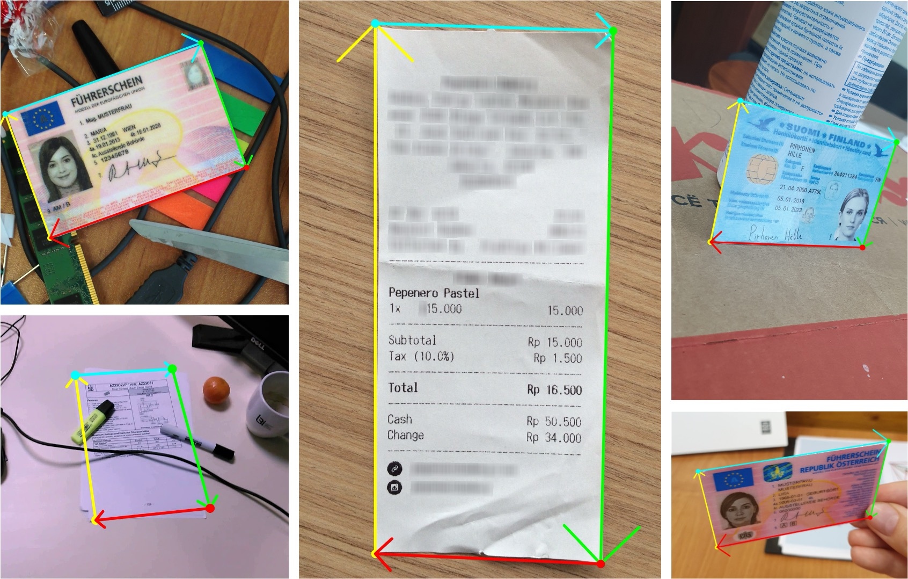
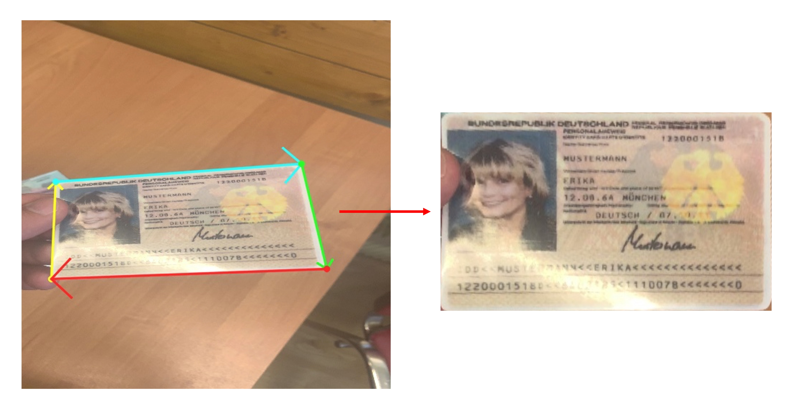
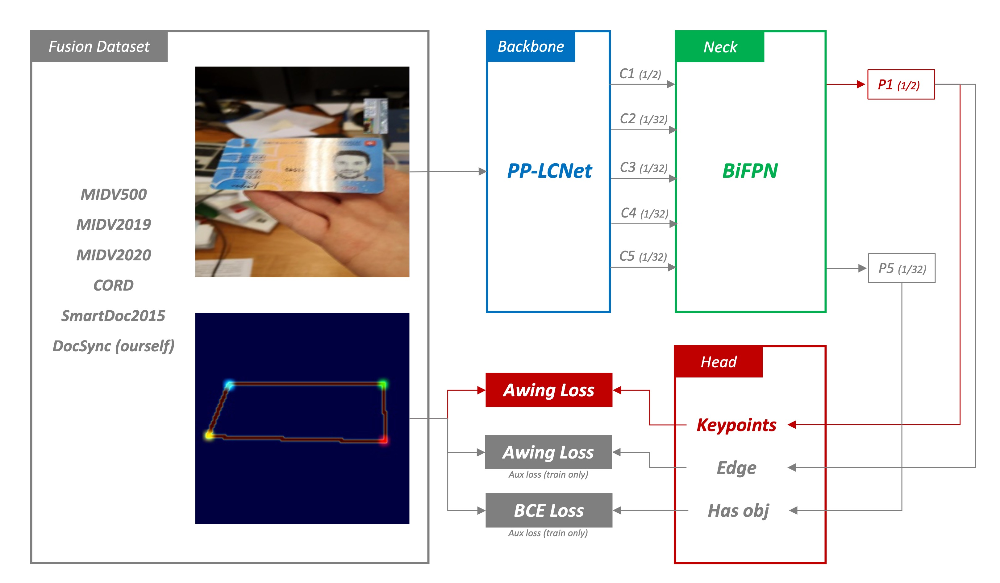
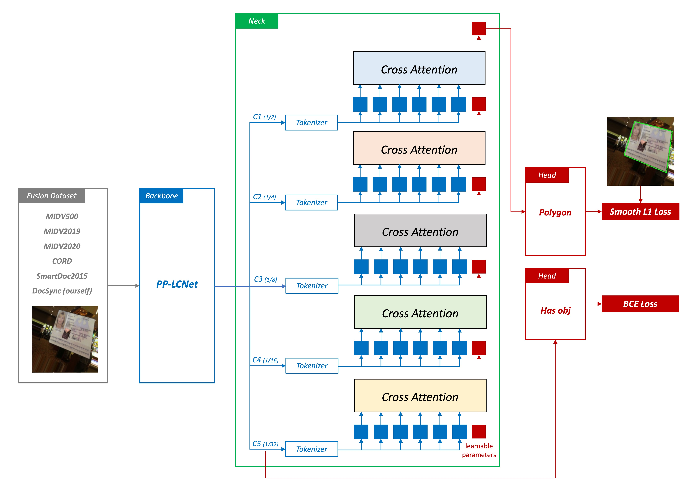
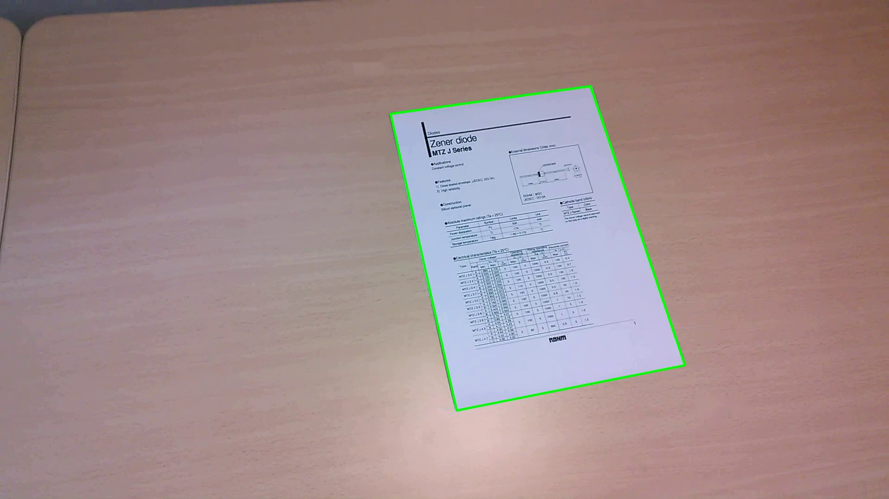
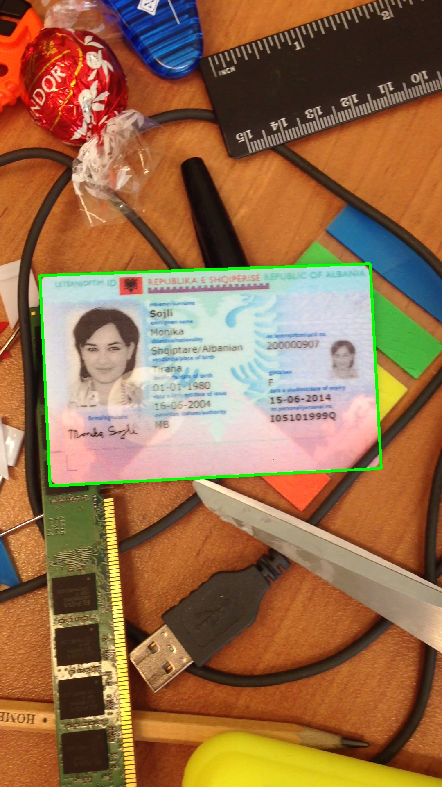
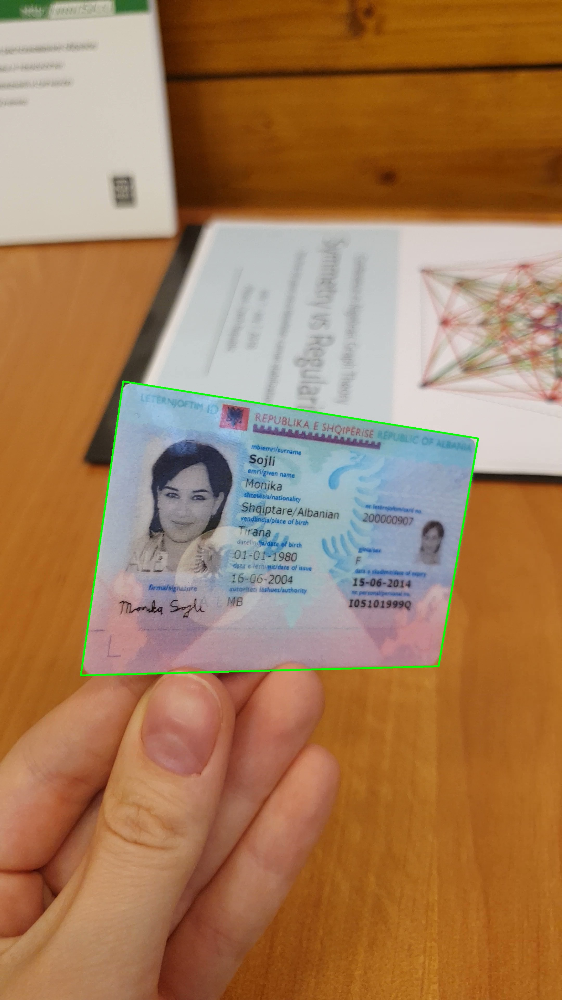
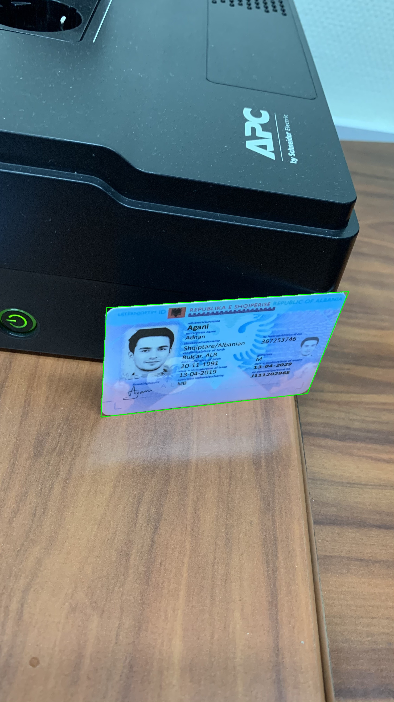
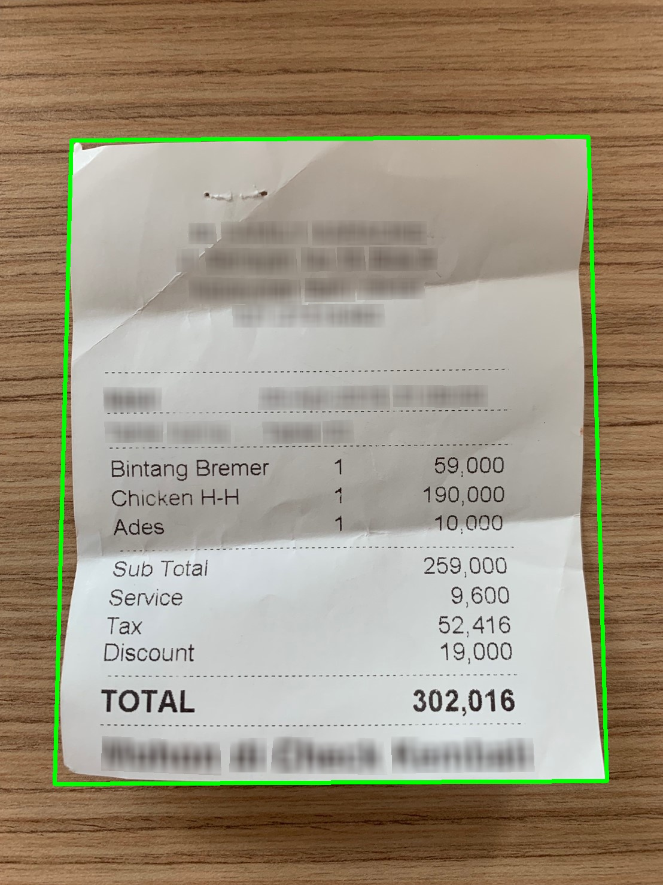
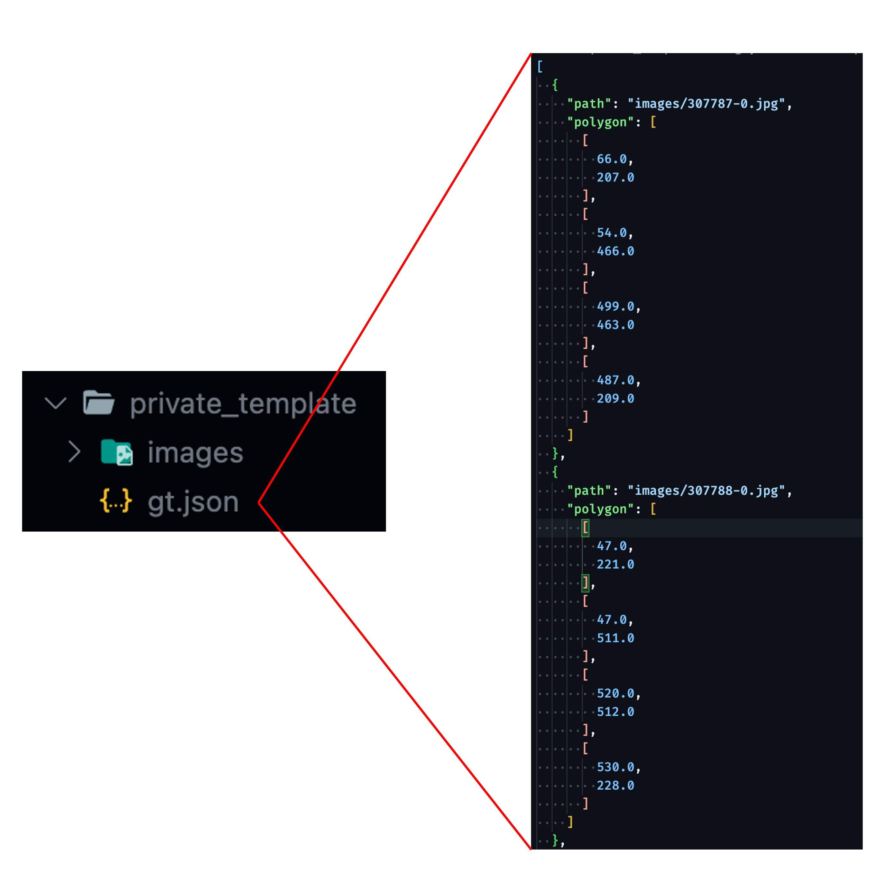

[English](./README.md) | **[中文](./README_cn.md)**

# DocAligner

<p align="left">
    <a href="./LICENSE"></a>
    <a href="https://github.com/DocsaidLab/DocAligner/releases"></a>
    <a href=""></a>
    <a href="https://doi.org/10.5281/zenodo.10442509"></a>
</p>

## 介紹

<div align="center">
    
</div>

本項目旨在開發一種視覺系統，專門用於圖像中文件的精確定位。我們的核心目標是準確預測文件的四個角點位置。此技術主要適用於金融科技、銀行業和共享經濟等行業，能有效降低圖像處理和文字分析任務的錯誤率及計算需求。

該系統的核心功能稱為「文件定位」（Document Localization）。我們的模型專門設計來識別圖像中的文件，並將其攤平，以便進行後續的文字識別或其他處理。我們提供兩種不同的模型：「熱圖模型」和「點回歸模型」，各具特點和適用場景，這些將在後續章節中詳細介紹。

在技術層面，我們選擇了 PyTorch 作為訓練框架，並使用 ONNXRuntime 進行模型推論，這使得我們的模型能在 CPU 和 GPU 上高效運行。此外，我們支持將模型轉換為 ONNX 格式，方便在不同平台上部署。對於需要量化的場景，我們提供基於 ONNXRuntime API 的靜態量化模型功能。

我們的模型在性能上達到接近最先進（SoTA）水平，並在實際應用中展示了即時（Real-Time）的推論速度，使其能夠滿足大多數應用場景的需求。

---

## 目錄

- [介紹](#介紹)
- [目錄](#目錄)
- [快速開始](#快速開始)
- [評估模型（Benchmark）](#評估模型benchmark)
- [開始訓練模型之前](#開始訓練模型之前)
- [訓練模型](#訓練模型)
- [資料集介紹](#資料集介紹)
- [資料集預處理](#資料集預處理)
- [資料集實作](#資料集實作)
- [構建訓練環境](#構建訓練環境)
- [執行訓練（Based on Docker）](#執行訓練based-on-docker)
- [轉換模型為 ONNX 格式（Based on Docker）](#轉換模型為-onnx-格式based-on-docker)
- [提交資料集](#提交資料集)
- [常見問題（FAQs）](#常見問題faqs)
- [引用](#引用)

---

## 快速開始

### 安裝

目前我們沒有提供 Pypi 上的安裝包，若要使用本專案，您可以直接從 Github 上 clone 本專案，然後安裝相依套件，安裝前請確認您已經安裝了 [DocsaidKit](https://github.com/DocsaidLab/DocsaidKit)。

若已經安裝 DocsaidKit，請按照以下步驟進行：

1. Clone 專案：

   ```bash
   git clone https://github.com/DocsaidLab/DocAligner.git
   ```

2. 進入專案目錄：

   ```bash
   cd DocAligner
   ```

3. 建立打包文件：

   ```bash
   python setup.py bdist_wheel
   ```

4. 安裝打包文件：

   ```bash
   pip install dist/docaligner-*-py3-none-any.whl
   ```

遵循這些步驟，您應該能夠順利完成 DocAligner 的安裝。

安裝完成後即可以使用本專案。

---

### 導入必要的依賴項

我們提供了一個簡單的模型推論介面，其中包含了前後處理的邏輯。

首先，您需要導入所需的相關依賴並創建 DocAligner 類別。


```python
import docsaidkit as D
from docsaidkit import Backend
from docaligner import DocAligner, ModelType
```

### ModelType

`ModelType` 是一個枚舉類型，用於指定 DocAligner 使用的模型類型。它包含以下選項：

- `heatmap`：使用熱圖模型進行文件對齊。
- `point`：使用點檢測模型進行文件對齊。

未來可能會有更多的模型類型，我們會在此處更新。

### Backend

`Backend` 是一個枚舉類型，用於指定 DocAligner 的運算後端。它包含以下選項：

- `cpu`：使用 CPU 進行運算。
- `cuda`：使用 GPU 進行運算（需要適當的硬體支援）。

ONNXRuntime 支援了非常多的後端，包括 CPU、CUDA、OpenCL、DirectX、TensorRT 等等，若您有其他需求，可以參考 [**ONNXRuntime Execution Providers**](https://onnxruntime.ai/docs/execution-providers/index.html)，並自行修改成對應的後端。

### 創建 DocAligner 實例

```python
model = DocAligner(
    gpu_id=0,  # GPU 編號，如果不使用 GPU 請設為 -1
    backend=Backend.cpu,  # 選擇運算後端，可以是 Backend.cpu 或 Backend.cuda
    model_type=ModelType.point  # 選擇模型類型，可以是 ModelType.heatmap 或 ModelType.point
)
```

注意事項：

- 使用 cuda 運算除了需要適當的硬體支援外，還需要安裝相應的 CUDA 驅動程式和 CUDA 工具包。如果您的系統中沒有安裝 CUDA，或安裝的版本不正確，則無法使用 CUDA 運算後端。

- 關於 onnxruntime 安裝依賴相關的問題，請參考 [ONNXRuntime Release Notes](https://onnxruntime.ai/docs/execution-providers/CUDA-ExecutionProvider.html#requirements)

### 讀取和處理圖像

```python
# 讀取圖像
img = D.imread('path/to/your/image.jpg')

# 您也可以使用我們提供的測試圖像
# img = D.imread('docs/run_test_card.jpg')

# 使用模型進行推論
result = model(img) # result 是一個 Document 類型
```

### 輸出結果

您得到的推論結果是經過我們包裝的 `Document` 類型，它包含了文件的多邊形、OCR 文字資訊等等。

`Document` 類別提供了多種功能，以協助處理和分析文件圖像。主要功能包括：

1. **文件多邊形處理**：能夠辨識和操作文件的邊界。
2. **OCR 文字辨識**：支援從圖像中辨識文字。
3. **圖像變形**：能夠根據文件的邊界轉換圖像。

- 屬性
    - `image`：存儲文件的圖像。
    - `doc_polygon`：文件的多邊形邊界。
    - `ocr_texts`：OCR 辨識出的文字列表。
    - `ocr_polygons`：與 `ocr_texts` 相對應的多邊形邊界。

- 方法
    - `gen_doc_flat_img()`：將文件圖像根據其多邊形邊界變形。
    - `gen_doc_info_image()`：生成一個標記了文件邊界和方向的圖像。
    - `gen_ocr_info_image()`：生成一個顯示 OCR 文字和其邊界的圖像。
    - `draw_doc()`：將標記了文件邊界的圖像保存到指定路徑。
    - `draw_ocr()`：將標記了 OCR 文字和邊界的圖像保存到指定路徑。

在這個模組中，我們不會用到 OCR 相關的功能，因此我們只會使用 `image` 和 `doc_polygon` 屬性。獲取到推論結果後，您可以進行多種後處理操作。

#### 繪製文件多邊形

```python
# 繪製並保存帶有文件多邊形的圖像
result.draw_doc('path/to/save/folder', 'output_image.jpg')
```

或不指定保存路徑，則會在當前目錄下保存，並自動給定一個時序編號。

```python
result.draw_doc()
```

#### 取得繪製後的 numpy 圖像

使用 `draw_doc` 功能預設會保存 JPG 格式的圖像，如果您有其他需求，可以使用 `gen_doc_info_image` 方法，之後再自行處理。

```python
img = result.gen_doc_info_image()
```

#### 提取攤平後的文件圖像

如果您知道文件的原始大小，即可以使用 `gen_doc_flat_img` 方法，將文件圖像根據其多邊形邊界轉換為矩形圖像。

```python
H, W = 1080, 1920
flat_img = result.gen_doc_flat_img(image_size=(H, W))
```

如果是一個未知的影像類別，也可以不用給定 `image_size` 參數，此時將會根據文件多邊形的邊界自動計算出最小的矩形圖像，並將最小矩形的長寬設為 `H` 和 `W`。

```python
flat_img = result.gen_doc_flat_img()
```

#### 將文件資訊轉為 JSON

如果您需要將文件資訊保存到 JSON 檔案中，可以使用 `be_jsonable` 方法。

轉換時，可以考慮將影像剔除，以節省空間，預設使用 `exclude_image=True`。

```python
doc_json = result.be_jsonable()
D.dump_json(doc_json)
```

#### 範例

```python
import docsaidkit as D
from docaligner import DocAligner

model = DocAligner(D.Backend.cpu)
img = D.imread('docs/run_test_card.jpg')
result = model(img)

# You can draw the result by yourself.
output_img = D.draw_polygon(img, result.doc_polygon)
flat_img = result.gen_doc_flat_img(image_size=(480, 800))
D.imwrite(output_img)
D.imwrite(flat_img)

# Or you can draw the colorful image from `draw_doc` method.
# result.draw_doc()
```

<div align="center">
    
</div>

---

## 評估模型（Benchmark）

我們使用了 [SmartDoc 2015](https://github.com/jchazalon/smartdoc15-ch1-dataset) 資料集作為我們的測試資料集。

### 評估協議

我們使用 **Jaccard Index** 作為衡量標準，這個指數總結了不同方法在正確分割頁面輪廓方面的能力，並對那些在某些畫面中未能檢測到文件對象的方法進行了懲罰。

評估過程首先是利用每個畫面中文件的大小和坐標，將提交方法 S 和基準真實 G 的四邊形坐標進行透視變換，以獲得校正後的四邊形 S0 和 G0。這樣的變換使得所有的評估量度在文件參考系內是可比的。對於每個畫面 f，計算 Jaccard 指數 (JI)，這是一種衡量校正四邊形重疊程度的指標，計算公式如下：


$$ JI(f) = \frac{\text{area}(G0 \cap S0)}{\text{area}(G0 \cup S0)} $$


其中 $` \text{area}(G0 \cap S0) `$ 定義為檢測到的四邊形和基準真實四邊形的交集多邊形，$` \text{area}(G0 \cup S0) `$ 則為它們的聯集多邊形。每種方法的總體分數將是測試數據集中所有畫面分數的平均值。

### 執行評估

我們提供了一個簡單的評估模組，可以用於評估模型於 SmartDoc2015 的效果。

請在執行前確認您已經下載了 `SmartDoc2015` 資料集，並且放置在 `/data/Dataset` 目錄下。不放在此目錄下也可以，但是需要修改 `DocAligner/docker/benchmark.bash` 腳本中的 `-v /data/Dataset:/data/Dataset` 對應路徑。

```bash
# 輸入內容依序為：
# 執行目標 bash、資料集名稱、模型類型、模型名稱。
bash DocAligner/docker/benchmark.bash smartdoc heatmap lcnet050
```

### 評估結果

<div align="center">

| Models | bg01 | bg02 | bg03 | bg04 | bg05 | Overall |
| :---: | :---: | :---: | :---: | :---: | :---: | :---: |
| HReg-MBV2_100-BiFPN-256 (Ours) |  - |  - |  - |  - |  - |  - |
| HReg-LC100-BiFPN-256 (Ours) |  0.9908 |  0.9877 |  0.9905 |  0.9894 |  0.9854 |  0.9892 |
| HReg-LC050-BiFPN-256 (Ours) |  0.9847 |  0.9822 |  0.9865 |  0.9811 |  0.9722 |  0.9826 |
| HReg-LC050-FPN-256 (Ours) |  0.9722 |  0.9744 |  0.9803 |  0.9739 |  0.9553 |  0.9732 |
| PReg-LC050-XAtt-256 (Ours) |  0.9663 |  0.9606 |  0.9664 |  0.9630 |  0.9199 |  0.9596 |
| - | - | - | - | - | - | - |
| HU-PageScan [1] | - | - | - | - | - | 0.9923 |
| Advanced Hough [2] |  0.9886 |  0.9858 |  0.9896 |  0.9806 |  - |  0.9866 |
| LDRNet [4] | 0.9877 | 0.9838 | 0.9862 | 0.9802 | 0.9858 | 0.9849 |
| Coarse-to-Fine [3] |  0.9876 |  0.9839 |  0.9830 |  0.9843 |  0.9614 |  0.9823 |
| SEECS-NUST-2 [3] |  0.9832 |  0.9724 |  0.9830 |  0.9695 |  0.9478 |  0.9743 |
| LDRE [5] | 0.9869 | 0.9775 | 0.9889 | 0.9837 | 0.8613 | 0.9716 |
| SmartEngines [5] |  0.9885 |  0.9833 |  0.9897 |  0.9785 |  0.6884 |  0.9548 |
| NetEase [5] |  0.9624 |  0.9552 |  0.9621 |  0.9511 |  0.2218 |  0.8820 |
| RPPDI-UPE [5] |  0.8274 |  0.9104 |  0.9697 |  0.3649 |  0.2162 |  0.7408 |
| SEECS-NUST [5] |  0.8875 |  0.8264 |  0.7832 |  0.7811 |  0.0113 |  0.7393 |

</div>

1. **HU-PageScan** 是一個基於像素分類的切割模型，雖然他的效果比較好，但模型尺寸及運算量較大，且受限於模型架構，對於部分遮蔽的樣態抵抗力較低，例如手指抓著邊角的這種情境，無法滿足實務上的需求。
    - Paper: [HU-PageScan: a fully convolutional neural network for document page crop](https://ietresearch.onlinelibrary.wiley.com/doi/full/10.1049/iet-ipr.2020.0532) (2021.02)
    - Github: [HU-PageScan](https://github.com/ricardobnjunior/HU-PageScan)

2. **Advanced Hough** 是 CV-Based 的模型，雖然效果不錯，但是凡使用 CV-Based 的模型，都會有一些缺點，例如對於光線和角度的敏感度。
    - Paper: [Advanced Hough-based method for on-device document localization](https://www.computeroptics.ru/KO/PDF/KO45-5/450509.pdf) (2021.06)
    - Github:  [hough_document_localization](https://github.com/SmartEngines/hough_document_localization)

3. **Coarse-to-Fine** 和 **SEECS-NUST-2** 是一個基於深度學習的模型，採用了遞迴優化的策略，效果不錯，但是很慢。
    - Paper: [Real-time Document Localization in Natural Images by Recursive Application of a CNN](https://khurramjaved.com/RecursiveCNN.pdf) (2017.11)
    - Paper: [Coarse-to-fine document localization in natural scene image with regional attention and recursive corner refinement](https://sci-hub.et-fine.com/10.1007/s10032-019-00341-0) (2019.07)
    - Github:  [Recursive-CNNs](https://github.com/KhurramJaved96/Recursive-CNNs)

4. **LDRNet** 是一個基於深度學習的模型，我們有使用他們提供的模型進行測試，發現該模型完全擬合在 SmartDoc 2015 資料集上，對於其他場景完全沒有泛化能力。我們也試著加入其他資料進行訓練，最終的表現也不理想，可能是這個架構對與特徵融合的能力不足。
    - Paper: [LDRNet: Enabling Real-time Document Localization on Mobile Devices](https://arxiv.org/abs/2206.02136) (2022.06)
    - Github:  [LDRNet](https://github.com/niuwagege/LDRNet)

5. **LDRE**、**SmartEngines**、**NetEase**、**RPPDI-UPE**、**SEECS-NUST** 以下的模型都是基於 CV-Based 的模型。
    - Paper: [ICDAR2015 Competition on Smartphone Document Capture and OCR (SmartDoc)](https://marcalr.github.io/pdfs/ICDAR15e.pdf) (2015.11)
    - Github:  [smartdoc15-ch1-dataset](https://github.com/jchazalon/smartdoc15-ch1-dataset)

### 結果分析

- 雖然我們的模型可以達到接近 SoTA 的分數，但現實場景遠比這個資料集複雜，因此不用過於在意這個分數，我們只是想要證明我們的模型是有效的。

- 由於我們盡量減少模型的大小和運算量，因此在實驗中，我們發現模型對於 Zero-shot 的能力並不好，也就是說，模型對於新的場景，需要進行微調才能達到最佳效果。

- 經過實驗，我們發現「熱圖回歸模型」的穩定性遠高於「點回歸模型」，因此我們仍會推薦您使用熱圖模型。

- 經過實驗，`BiFPN`（3層） 效果仍優於 `FPN`（6層），因此我們推薦您使用 `BiFPN`。但是 `BiFPN` 有用到 `einsum` 的操作，可能會導致其他推論框架的困擾，因此若您在使用 `BiFPN` 時候遇到錯誤，可以考慮改為 `FPN` 模型。

- 儘管「熱圖回歸模型」表現穩定，但由於需要在高解析度的特徵圖上進行監督，因此模型的運算量遠高於「點回歸模型」。

- 但我們仍無法割捨「點回歸模型」的優點，包含但不限於：可以預測圖面範圍之外的角點；計算量低及快速簡單的後處理流程等。因此我們會持續優化「點回歸模型」，以提升其效果。

- 以下是模型的比較表格：

    | Model Name             | Parameters (M) | FP32 Size (MB) | FLOPs(G) | Overall Score |
    |:----------------------:|:--------------:|:--------------:|:--------:|:-------------:|
    | HReg-LC100-BiFPN-256   |      1.2       |      4.9       |   1.6    |     0.9892    |
    | HReg-LC050-BiFPN-256   |      0.42      |      1.7       |   1.2    |     0.9826    |
    | HReg-LC050-FPN-256     |      0.42      |      1.7       |   1.6    |     0.9732    |
    | PReg-LC050-XAtt-256    |      1.1       |      4.5       |   0.22   |     0.9596    |

---

## 開始訓練模型之前

根據我們所提供的模型，我們相信能解決大部分的應用場景，但是我們也知道，有些場景可能需要更好的模型效果，因此必須自行搜集資料集，並且進行模型微調。我們體諒到您可能只有經費，而沒有足夠的時間對您的現場環境進行客製化調整。因此您可以直接聯絡我們進行諮詢，我們可以根據您施工難度，幫您安排一些工程師來進行客製化的開發。

一個直觀且具體的例子是：

您需要在一個特定角度和光源下，擷取某一種文本的區域，卻發現我們所提供的模型效果不佳，此時您可以聯絡我們，並且提供一些您收集的資料，我們可以直接把模型強制擬合在您的資料集上面。這樣的方式可以大幅提升模型的效果，但是需要花費大量的時間和人力，因此我們會根據您的需求，提供一個合理的報價。

另外，如果您不急迫，**您可以直接把您的文本或場景資料集提供給我們**，我們會在未來的某一天的某個版本中（沒有提供時程限制），將您的資料集納入我們的測試資料集中，並且在未來的版本中，提供更好的模型效果，選擇這種方式對您來說是完全免費的。

- **請注意：我們絕對不會開源您提供的資料，除非您自行提出要求。正常流程下，資料只會用於更新模型。**

我們樂於見到您選擇第二種方式，因為這樣可以讓我們的模型更加完善，也可以讓更多的人受益。

提交資料集的方式，請參閱：[**提交資料集**](#提交資料集)。

我們的聯絡方式：**docsaidlab@gmail.com**

---

## 訓練模型

我們不提供模型微調的功能，但是您可以使用我們的訓練模組，自行產出模型。

以下我們提供一套完整的訓練流程，幫助您從頭開始。

大致上來說，需要遵循幾個步驟：

1. **準備資料集**：蒐集並整理適合您需求的數據。
2. **建立訓練環境**：配置所需的硬體和軟體環境。
3. **執行訓練**：使用您的數據訓練模型。
4. **評估模型**：檢測模型的效能並進行調整。
5. **轉換為 ONNX 格式**：為了更好的兼容性和效能，將模型轉換成 ONNX 格式。
6. **評估量化需求**：決定是否需要量化模型以優化效能。
7. **整合並打包模型**：將 ONNX 模型整合到您的專案中。

以下我們開始逐步說明訓練流程。

---

## 模型架構設計

### 熱圖回歸模型

<div align="center">
    
</div>

- **Backbone: LCNet**

    Backbone 是模型的主體，負責提取輸入數據中的特徵。

    在這個模型中，使用的是 LCNet，這是一種輕量級的卷積神經網絡，特別適用於在計算資源受限的環境下進行高效的特徵提取。

    我們預期 LCNet 應該能從輸入數據中提取出足夠的特徵信息，為後續的熱圖回歸做好準備。

- **Neck: BiFPN**

    Neck 部分是用於增強從 Backbone 流出的特徵。

    BiFPN (Bidirectional Feature Pyramid Network) 通過上下文信息的雙向流動，增強了特徵的表達能力。我們預期 BiFPN 會產生一系列尺度豐富且語義強的特徵圖，這些特徵圖對於捕捉不同尺度的對象非常有效，並對最終的預測精度有正面影響。

- **Head: Heatmap Regression**

    Head 部分是模型的最終階段，專門用於根據前面提取和加強的特徵來進行最終的預測。

    在這個模型中，使用的是熱圖回歸技術，這是一種常用於物體檢測和姿勢估計的方法，能夠精確地預測對象的位置。熱圖回歸將生成物體的熱圖表示，這些熱圖反映了物體出現在不同位置的可能性。通過分析這些熱圖，模型能夠準確地預測出物體的位置和姿態。

- **Loss: Adaptive Wing Loss**

    Loss 是模型訓練的關鍵，負責計算模型預測結果和真實標籤之間的差異。

    在這個模型中，使用的是 Adaptive Wing Loss，這是一種專門用於人臉關鍵點檢測的損失函數，這種方法是針對熱圖回歸中的損失函數進行創新，特別適用於人臉對齊問題。其核心思想是讓損失函數能夠根據不同類型的真實熱圖像素調整其形狀，對前景像素（即人臉特徵點附近的像素）施加更多的懲罰，而對背景像素施加較少的懲罰。

    在這裡，我們將文件角點預測的問題視為人臉關鍵點檢測問題，並使用專門用於人臉關鍵點檢測的損失函數。我們認為這種方法能夠有效地解決文件角點檢測中的問題，並且能夠在不同的場景中取得良好的效果。

    **Reference: [Adaptive Wing Loss for Robust Face Alignment via Heatmap Regression](https://arxiv.org/abs/1904.07399)**

    除了角點的損失之外，我們也用了多個輔助的損失，包括：

    - **Edge Loss:** 這是一種用於邊界檢測的損失函數，也是採用熱圖回歸的機制，使用 AWing Loss。
    - **Classification Loss:** 這是一種用於分類的損失函數，用於預測圖像中是否存在文件，使用 BCE Loss。

### 點回歸模型

<div align="center">
    
</div>

- **Backbone: LCNet**

    這裡的 Backbone 跟熱圖回歸模型的 Backbone 是相同的，我們使用了 LCNet 來提取特徵。

    至於為什麼不放棄 CNN 架構，採用全 Transformer 架構？原因是參數量和計算量的限制。經過我們的實驗，當參數量過低時，Transformer 無法展現出其優勢，因此我們選擇了 LCNet 作為 Backbone。

- **Neck: Cross-Attention**

    Neck 部分是用於增強從 Backbone 流出的特徵。

    在這個模型中，我們使用了 Cross-Attention 機制，這是一種 Transformer 中常用的機制，能夠捕捉不同特徵之間的關係，並將這些關係應用於特徵的增強。我們預期 Cross-Attention 能夠幫助模型理解圖像中不同點之間的空間關係，從而提高預測的準確性。除了 Cross-Attention 之外，我們還使用了位置編碼（positional encodings），這些編碼有助於模型理解圖像中點的空間位置，從而提高預測的準確性。

    我們考慮點回歸的特性，對於精確的像素定位，非常依賴於低級的特徵。因此我們從深層特徵開始，依序往淺層特徵（1/32 -> 1/16 -> 1/8 -> 1/4 -> 1/2）進行查詢，這樣的設計能夠讓模型在不同尺度的特徵中找到文件的位置。我們認為這種查詢方式能夠有效地提高模型的準確性。

- **Head: Point Regression**

    我們僅使用一個簡單的線性層作為 Head，將特徵轉換為點的坐標。我們希望模型可以更依賴於 Cross-Attention 的特徵的表達能力，而不是依賴於複雜頭部架構。

- **Loss: Smooth L1 Loss**

    在我們的模型中，我們選擇使用 Smooth L1 Loss 作為損失函數，這是一種在回歸任務中常用的損失函數，特別適用於處理存在異常值的情況。與傳統的 L1 Loss 相比，Smooth L1 Loss 在預測值與真實值差異較大時更加穩健，能夠減少異常值對模型訓練的影響。此外，為了降低點回歸的放大誤差，我們將點預測的權重提高至 1000，經過我們的實驗，這樣的設計能夠有效地提高模型的準確性。

    除了角點的損失之外，我們也用了其他的損失，包括：

    - **Classification Loss:** 這是一種用於分類的損失函數，用於預測圖像中是否存在文件，使用 BCE Loss。

    請注意，這裡的分類損失並非只是輔助損失，而是主要損失之一，因為角點預測本身的限制，當遇到沒有目標物的情況時，仍會預測出角點，因此在部署階段，我們需要分類頭來告訴我們是否有目標物。

---

## 資料集介紹

- **SmartDoc 2015**
    - [**SmartDoc 2015**](https://github.com/jchazalon/smartdoc15-ch1-dataset)
    - Smartdoc 2015 - Challenge 1 資料集最初是為 Smartdoc 2015 競賽創建的，重點是評估使用智慧型手機的文件影像擷取方法。 Challenge 1 特別在於偵測和分割從智慧型手機預覽串流中擷取的視訊畫面中的文件區域。

- **MIDV-500/MIDV-2019**
   - [**MIDV**](https://github.com/fcakyon/midv500)
   - MIDV-500 由 50 個不同身分證明文件類型的500 個影片片段組成，包括 17 個身分證、14 個護照、13 個駕照和 6 個不同國家的其他身分證明文件，並具有真實性，可以對各種文件分析問題進行廣泛的研究。
   - MIDV-2019 資料集包含扭曲和低光影像。

- **MIDV-2020:**
   - [**MIDV2020**](http://l3i-share.univ-lr.fr/MIDV2020/midv2020.html)
   - MIDV-2020 包含 10 種文件類型，其中包括 1000 個帶註釋的影片剪輯、1000 個掃描影像和 1000 個獨特模擬身分文件的 1000 張照片，每個文件都具有唯一的文字欄位值和唯一的人工生成的面孔。

- **Indoor Scenes**
   - [**Indoor**](https://web.mit.edu/torralba/www/indoor.html)
   - 該資料集包含 67 個室內類別，總共 15,620 張圖像。圖像數量因類別而異，但每個類別至少有 100 張圖像。所有圖片均為 jpg 格式。

- **CORD v0**
   - [**CORD**](https://github.com/clovaai/cord)
   - 該資料集由數千張印尼收據組成，其中包含用於 OCR 的圖像文字註釋，以及用於解析的多層語義標籤。所提出的資料集可用於解決各種 OCR 和解析任務。

- **Docpool**
   - [**Docpool**](./data/docpool/)
   - 我們自行從網路收集各類文本影像，用在動態合成影像技術作為訓練資料集。


## 資料集預處理

1. **安裝 MIDV-500 套件：**

    ```bash
    pip install midv500
    ```

2. **下載資料集：**

    - **MIDV-500/MIDV-2019：**
      安裝後執行 `download_midv.py`。

      ```bash
      cd DocAligner/data
      python download_midv.py
      ```

    - **MIDV-2020：**
      訪問各自的鏈接，並按照其下載說明操作。

    - **SmartDoc 2015：**
      訪問各自的鏈接，並按照其下載說明操作。

    - **室內場景 & CORD v0:**
      訪問各自的鏈接，並按照其下載說明操作。

3. **建構資料集：**

    把 MIDV 和 CORD 資料集放在同一個地方，並在 `build_dataset.py` 中設定 `ROOT` 變數為儲存資料集的目錄。確認完成後，執行以下命令：

    ```bash
    python build_dataset.py
    ```

   完成後，會產生多個 `.json` 檔案。這些檔案包含了資料集的所有資訊，包括圖像路徑、標籤、圖像大小等等。

## 資料集實作

我們針對上述的幾個資料集，進行對應於 pytorch 訓練的資料集實作，請參考 [dataset.py](./model/dataset.py)。

以下我們實際展示如何讀取資料集：

### 1. SmartDoc 2015 資料集

```python
import docsaidkit as D
from model.dataset import SmartDocDataset

ds = SmartDocDataset(
    root="/data/Dataset" # Replace with your dataset directory
    mode="val", # "train" or "val"
    train_ratio=0.2 # Using 20% of the data for training and 80% for validation.

# 只有 SmartDoc 2015 資料集有第三個回傳值，用來作為驗證集與 benchmark 所使用。
img, poly, doc_type = ds[0]

# 如果設定 `mode="train"`，則只會回傳前兩個值。
# img, poly = ds[0]

D.imwrite(D.draw_polygon(img, poly, thickness=5), 'smartdoc_test_img.jpg')
```

<div align="center">
    
</div>

### 2. MIDV-500 資料集

```python
import docsaidkit as D
from model.dataset import MIDV500Dataset

ds = MIDV500Dataset(
    root="/data/Dataset" # 請替換成您的資料集目錄
)

img, poly = ds[0]
D.imwrite(D.draw_polygon(img, poly, thickness=5), 'midv500_test_img.jpg')
```

<div align="center">
    
</div>

### 3. MIDV-2019 資料集

```python
import docsaidkit as D
from model.dataset import MIDV2019Dataset

ds = MIDV2019Dataset(
    root="/data/Dataset" # 請替換成您的資料集目錄
)

img, poly = ds[0]
D.imwrite(D.draw_polygon(img, poly, thickness=5), 'midv2019_test_img.jpg')
```

<div align="center">
    
</div>

### 4. MIDV-2020 資料集

```python
import docsaidkit as D
from model.dataset import MIDV2020Dataset

ds = MIDV2020Dataset(
    root="/data/Dataset" # 請替換成您的資料集目錄
)

img, poly = ds[0]
D.imwrite(D.draw_polygon(img, poly, thickness=3), 'midv2020_test_img.jpg')
```

<div align="center">
    
</div>


### 5. CORD v0 資料集

```python
import docsaidkit as D
from model.dataset import CordDataset

ds = CordDataset(
    root="/data/Dataset" # 請替換成您的資料集目錄
)

img, poly = ds[0]
D.imwrite(D.draw_polygon(img, poly, thickness=5), 'cordv0_test_img.jpg')
```

<div align="center">
    
</div>

### 6. 合成資料集

考慮到資料集的不足，我們使用動態合成影像技術。

簡單來說，我們先收集了一份 Docpool 資料集，其中包含了從網路上找到的各類證件和文件的影像。接著，我們找來了 Indoor 資料集作為背景，然後將 Docpool 內的資料，合成到背景上。

此外，MIDV-500/MIDV-2019/CORD 資料集中，也都有對應的 Polygon 資料，秉持著不浪費的精神，我們也會將 Docpool 內的圖片合成到這些資料集上，以增加資料集的多樣性。

總之，拿來用就對了，實作細節什麼的，您不感興趣就直接放到一邊就好。

```python
import docsaidkit as D
from model.dataset import SyncDataset

ds = SyncDataset(
    root="/data/Dataset" # 請替換成您的資料集目錄
)

img, poly = ds[0]
D.imwrite(D.draw_polygon(img, poly, thickness=2), 'sync_test_img.jpg')
```

<div align="center">
    
</div>


### 7. 影像增強

儘管我們已經收集了一些的資料，但是這些資料的多樣性仍然不足。為了增加資料的多樣性，我們使用了影像增強技術，這些技術可以模擬圖像在拍攝時的各種情況，例如遮擋、移動、旋轉、模糊、噪聲、顏色變化等等。

```python
import cv2
import numpy as np
import docsaidkit as D
import docsaidkit.torch as DT
import albumentations as A

DIR = D.get_curdir(__file__)

ds = D.load_json(DIR.parent / 'data' / 'indoor_dataset.json')

bg_dataset = []
for data in D.Tqdm(ds):
    img_path = D.Path('/data/Dataset') / data['img_path']
    if D.imread(img_path) is None:
        continue
    bg_dataset.append(img_path)


class DefaultImageAug:

    def __init__(self, p=0.5):
        self.coarse_drop_aug = DT.CoarseDropout(
            max_holes=1,
            min_height=24,
            max_height=48,
            min_width=24,
            max_width=48,
            mask_fill_value=255,
            p=p
        )
        self.aug = A.Compose([

            DT.ShiftScaleRotate(
                shift_limit=0.1,
                scale_limit=[-0.2, 0]
            ),

            A.OneOf([
                A.Spatter(mode='mud'),
                A.GaussNoise(),
                A.ISONoise(),
                A.MotionBlur(),
                A.Defocus(),
                A.GaussianBlur(blur_limit=(3, 11), p=0.5),
            ], p=p),

            A.OneOf([
                A.HorizontalFlip(),
                A.VerticalFlip(),
                A.RandomRotate90(),
            ], p=p),

            A.OneOf([
                A.ColorJitter(),
                A.ChannelShuffle(),
                A.ChannelDropout(),
                A.RGBShift(),
            ])

        ], p=p, keypoint_params=A.KeypointParams(format='xy', remove_invisible=False))

    def __call__(self, image: np.ndarray, keypoints: np.ndarray) -> Any:
        mask = np.zeros_like(image)
        img, mask = self.coarse_drop_aug(image=image, mask=mask).values()
        background = bg_dataset[np.random.randint(len(bg_dataset))]
        background = D.imread(background)
        background = D.imresize(background, (image.shape[0], image.shape[1]))
        if mask.sum() > 0:
            img[mask > 0] = background[mask > 0]
        img, kps = self.aug(image=img, keypoints=keypoints).values()
        kps = D.order_points_clockwise(np.array(kps))
        return img, kps
```

- **CoarseDropout**
   - 這個增強技術會隨機在圖像中產生一個矩形區域，並將該區域內的像素值設為隨機背景內容。可以模擬圖像中的遮擋，例如圖像中的文字被其他物體遮擋的情況。

- **GaussianBlur**
    - 這個增強技術會對圖像進行高斯模糊。可以模擬圖像在拍攝時的高斯模糊，次外，合成影像會有比較銳利的邊緣特徵，這個增強技術可以模糊邊緣特徵。讓他們看起來更像真實的影像。

- **Others**
    - 這些增強技術可以模擬圖像在拍攝時的各種情況，例如移動、旋轉、模糊、噪聲、顏色變化等等。

---

## 構建訓練環境

首先，請您確保已經從 `DocsaidKit` 內建置了基礎映像 `docsaid_training_base_image`。

如果您還沒有這樣做，請先參考 `DocsaidKit` 的說明文件。

```bash
# Build base image from docsaidkit at first
git clone https://github.com/DocsaidLab/DocsaidKit.git
cd DocsaidKit
bash docker/build.bash
```

接著，請使用以下指令來建置 DocAligner 工作的 Docker 映像：

```bash
# Then build DocAligner image
git clone https://github.com/DocsaidLab/DocAligner.git
cd DocAligner
bash docker/build.bash
```

這是我們預設採用的 [Dockerfile](./docker/Dockerfile)，專門為執行文件對齊訓練設計，我們為該文件附上簡短的說明，您可以根據自己的需求進行修改：

1. **基礎鏡像**
    - `FROM docsaid_training_base_image:latest`
    - 這行指定了容器的基礎鏡像，即 `docsaid_training_base_image` 的最新版本。基礎映像像是建立您的 Docker 容器的起點，它包含了預先配置好的作業系統和一些基本的工具，您可以在 `DocsaidKit` 的專案中找到它。

2. **工作目錄設定**
    - `WORKDIR /code`
    - 這裡設定了容器內的工作目錄為 `/code`。 工作目錄是 Docker 容器中的一個目錄，您的應用程式和所有的命令都會在這個目錄下運作。

3. **環境變數**
    - `ENV ENTRYPOINT_SCRIPT=/entrypoint.sh`
    - 這行定義了一個環境變數 `ENTRYPOINT_SCRIPT`，其值設定為 `/entrypoint.sh`。 環境變數用於儲存常用配置，可以在容器的任何地方存取。

4. **安裝 gosu**
    - 透過 `RUN` 指令安裝了 `gosu`。 `gosu` 是一個輕量級的工具，允許使用者以特定的使用者身分執行命令，類似於 `sudo`，但更適合 Docker 容器。
    - `apt-get update && apt-get install -y gosu && rm -rf /var/lib/apt/lists/*` 這行指令首先更新了套件列表，然後安裝`gosu`，最後清理了不再需要 的檔案以減小鏡像大小。

5. **建立入口點腳本**
    - 透過一系列 `RUN` 指令建立了入口點腳本 `/entrypoint.sh`。
    - 此腳本首先檢查環境變數 `USER_ID` 和 `GROUP_ID` 是否被設定。 如果設定了，腳本會建立一個新的使用者和使用者群組，並以該使用者身分執行命令。
    - 這對於處理容器內外檔案權限問題非常有用，特別是當容器需要存取宿主機上的檔案時。

6. **賦予權限**
    - `RUN chmod +x "$ENTRYPOINT_SCRIPT"` 這行指令使入口點腳本成為可執行檔。

7. **設定容器的入口點和預設指令**
    - `ENTRYPOINT ["/bin/bash", "/entrypoint.sh"]` 和 `CMD ["bash"]`
    - 這些命令指定了容器啟動時執行的預設命令。 當容器啟動時，它將執行 `/entrypoint.sh` 腳本。

---

## 執行訓練（Based on Docker）

這部分的說明如何利用您已經構建的 Docker 映像來執行文件對齊訓練。

首先，請您看到 `train.bash` 檔案內容：

```bash
#!/bin/bash

cat > trainer.py <<EOF
from fire import Fire
from DocAligner.model import main_docaligner_train

if __name__ == '__main__':
    Fire(main_docaligner_train)
EOF

docker run \
    -e USER_ID=$(id -u) \
    -e GROUP_ID=$(id -g) \
    --gpus all \
    --shm-size=64g \
    --ipc=host --net=host \
    --cpuset-cpus="0-31" \
    -v $PWD/DocAligner:/code/DocAligner \
    -v $PWD/trainer.py:/code/trainer.py \
    -v /data/Dataset:/data/Dataset \
    -it --rm doc_align_train python trainer.py --cfg_name $1
```

針對上述檔案的說明如下，如果您想要動手修改的話，可以參考相關資訊：

1. **創建訓練腳本**
   - `cat > trainer.py <<EOF ... EOF`
   - 這段命令創建了一個 Python 腳本 `trainer.py`。這個腳本導入了必要的模塊和函數，並在腳本的主部分中調用 `main_docalign_train` 函數。使用 Google's Python Fire 庫來解析命令行參數，使得命令行界面的生成更加容易。

2. **運行 Docker 容器**
   - `docker run ... doc_align_train python trainer.py --cfg_name $1`
   - 這行命令啟動了一個 Docker 容器，並在其中運行 `trainer.py` 腳本。
   - `-e USER_ID=$(id -u) -e GROUP_ID=$(id -g)`：這些參數將當前用戶的用戶 ID 和組 ID 傳遞給容器，以便在容器內創建具有相應權限的用戶。
   - `--gpus all`：指定容器可以使用所有 GPU。
   - `--shm-size=64g`：設置共享內存的大小，這在大規模數據處理時很有用。
   - `--ipc=host --net=host`：這些設置允許容器使用主機的 IPC 命名空間和網絡堆棧，有助於性能提升。
   - `--cpuset-cpus="0-31"`：指定容器使用哪些 CPU 核心。
   - `-v $PWD/DocAligner:/code/DocAligner` 等：這些是掛載參數，將主機的目錄映射到容器內部的目錄，以便於訓練數據和腳本的訪問。
   - `--cfg_name $1`：這是傳遞給 `trainer.py` 的參數，指定了配置文件的名稱。

3. **數據集路徑**
   - 特別注意 `/data/Dataset` 是用於存放訓練數據的路徑，您會需要調整 `-v /data/Dataset:/data/Dataset` 這段指令，把 `/data/Dataset` 替換成您的資料集目錄。

最後，請退到 `DocAligner` 的上層目錄，並執行以下指令來啟動訓練：

```bash
bash DocAligner/docker/train.bash lcnet100_point_reg_bifpn # 這裡替換成您的配置文件名稱
```

- 補充：配置文件說明可以參考 [DocAligner/model/README.md](./model/README.md)。

通過這些步驟，您可以在 Docker 容器內安全地執行文件對齊訓練任務，同時利用 Docker 的隔離環境來確保一致性和可重現性。這種方法使得項目的部署和擴展變得更加方便和靈活。

---

## 轉換模型為 ONNX 格式（Based on Docker）

這部分的說明如何利用您的模型轉換為 ONNX 格式。

首先，請您看到 `to_onnx.bash` 檔案內容：

```bash
#!/bin/bash

cat > torch2onnx.py <<EOF
from fire import Fire
from DocAligner.model import main_docaligner_torch2onnx

if __name__ == '__main__':
    Fire(main_docaligner_torch2onnx)
EOF

docker run \
    -e USER_ID=$(id -u) \
    -e GROUP_ID=$(id -g) \
    --shm-size=64g \
    --ipc=host --net=host \
    -v $PWD/DocAligner:/code/DocAligner \
    -v $PWD/torch2onnx.py:/code/torch2onnx.py \
    -v /data/Dataset:/data/Dataset \
    -it --rm doc_align_train python torch2onnx.py --cfg_name $1
```

從這個檔案開始看起，但不需要修改它，您需要去修改對應的檔案：`model/to_onnx.py`

在訓練過程中，您可能會使用許多分支來監督模型的訓練，但是在推論階段，您可能只需要其中的一個分支。因此，我們需要將模型轉換為 ONNX 格式，並且只保留推論階段所需要的分支。

例如：

```python
class WarpLC100FPN(nn.Module):

    def __init__(self, model: L.LightningModule):
        super().__init__()
        self.backbone = model.backbone
        self.neck = model.neck
        self.head = model.head

    def forward(self, img: torch.Tensor):
        return self.head(self.neck(self.backbone(img)))

```

在上面這個範例中，我們只取出推論用的分支，並且將其封裝為一個新的模型 `WarpLC100FPN`。接著，在 yaml config 上進行相對應的參數設定：

```yaml
onnx:
  name: WarpLC100FPN
  input_shape:
    img:
      shape: [1, 3, 256, 256]
      dtype: float32
  input_names: ['img']
  output_names: ['output']
  dynamic_axes:
    img:
      '0': batch_size
    output:
      '0': batch_size
  options:
    opset_version: 16
    verbose: False
    do_constant_folding: True
```

說明模型的輸入尺寸，輸入名稱，輸出名稱，以及 ONNX 的版本號。

轉換的部分我們已經幫您寫好了，完成上面的修改後，確認 `model/to_onnx.py` 檔案有指向您的模型，並且退到 `DocAligner` 的上層目錄，並執行以下指令來啟動轉換：

```bash
bash DocAligner/docker/to_onnx.bash lcnet100_point_reg_bifpn # 這裡替換成您的配置文件名稱
```

這時候，您會在 `DocAligner/model` 目錄下看到一個新的 ONNX 模型，把這個模型搬到 `docaligner/xxx` 對應的推論模型目錄下，就可以進行推論了。

---

## 提交資料集

首先，我們非常感謝您願意提供資料集，我們會在第一時間進行測試和整合。

提交資料的格式範例如下：

<div align="center">
    
</div>

您可以看到，首先是一個資料集，內有您搜集的影像，並且在同一個目錄下，有一個 `gt.json` 檔案，裡面包含了每張影像的標籤。

標籤格式內容必須要有：

1. 影像相對路徑
2. 影像中文件的「四個角點的多邊形」邊界

    ```json
    [
        {
            "file_path": "path/to/your/image.jpg",
            "polygon": [
                [
                    [0, 0],
                    [0, 1080],
                    [1920, 1080],
                    [1920, 0]
                ]
            ]
        }
    ]
    ```

請注意上面所提到的資料格式與命名規範並不嚴格，大致上只要包含了影像路徑和多邊形邊界即可，但是為了方便我們進行測試，請盡量遵循上面的格式。

標籤資料我們會建議您使用 [LabelMe](https://github.com/labelmeai/labelme)，它是一個開源的標籤工具，可以幫助您快速標註影像，並且導出成 JSON 檔案。

建議您將資料上傳至您的 google 雲端，並透過[電子郵件](docsaidlab@gmail.com)提供給我們連結，我們會在收到您的資料後，盡快進行測試和整合。若您所提供的資料不符合我們的需求，我們會在第一時間通知您。

- **不符合需求的原因可能有**：
    - **資料集精度不足**：例如您的資料集中，有些影像的標籤不夠精確，或者有些影像的標籤是錯誤的。
    - **資料集標籤目標不明確**：我們要解決的問題是在影像中定位文件的四個角點，因此若您的資料中有超過「一個以上的目標」，或超過「四個以上的角點」，則無法使用。
    - **目標物太小**：若您的目標物太小，則我們建議您要重新考慮演算法的選擇，因為我們的模型並不適合處理小目標物，也跟我們便於後處理的目標不相符。
    - **資料集規模過於精緻**：就算您提供的資料只有數十張，我們也會欣然接受，但這樣的資料若用來擬合模型，則會造成過度擬合的問題，因此我們會建議您增加資料集的規模，以避免過度擬合的問題。

---

## 常見問題（FAQs）

1. **四個角點的順序是否重要？**
   - 不重要。我們的訓練過程會自動排序這些角點。

2. **標籤格式的要求有哪些？**
   - 格式上的要求不嚴格，只需包含影像路徑和多邊形邊界即可。但為了方便測試，建議盡量遵循標準格式。

3. **檔案名稱的重要性如何？**
   - 檔案名稱不是主要關注點，只要能正確連接到相應的影像即可。

4. **影像格式有何建議？**
   - 建議使用 jpg 格式以節省空間。

5. **標籤的精度對模型訓練的影響如何？**
   - 標籤精度極其重要，不精確的標籤會直接影響模型訓練的效果。

6. **標籤的目標物類型重要嗎？**
   - 是的，非常重要。
   - 目標物必須是文件，且每張影像中只能有一個目標物。

7. **目標物的大小對模型訓練有何影響？**
   - 目標物的大小很重要。我們的模型不適合處理小型目標物，因為這會影響後續處理的效率。

8. **如何定義「小目標物」？**
   - 以 1920x1080 解析度的影像為例，如果目標物小於 32 x 32 像素，則視為小目標物。具體計算公式為 `min(img_w, img_h) / 32`。

若需要更多幫助，請透過電子郵件與我們聯繫：**docsaidlab@gmail.com**

---

## 引用

我們感謝所有走在前面的人，他們的工作對我們的研究有莫大的幫助。

如果您認為我們的工作對您有幫助，請引用以下相關論文：

```bibtex
@misc{yuan2023docaligner,
  author = {Ze Yuan},
  title = {DocAligner},
  year = {2023},
  publisher = {GitHub},
  journal = {GitHub repository},
  doi = {10.5281/zenodo.10442509},
  howpublished = {\url{https://github.com/DocsaidLab/DocAligner}}
}

@misc{rw2019timm,
  author = {Ross Wightman},
  title = {PyTorch Image Models},
  year = {2019},
  publisher = {GitHub},
  journal = {GitHub repository},
  doi = {10.5281/zenodo.4414861},
  howpublished = {\url{https://github.com/rwightman/pytorch-image-models}}
}

@inproceedings{quattoni2009recognizing,
  title={Recognizing indoor scenes},
  author={Quattoni, Ariadna and Torralba, Antonio},
  booktitle={2009 IEEE conference on computer vision and pattern recognition},
  pages={413--420},
  year={2009},
  organization={IEEE}
}

@inproceedings{park2019cord,
  title={CORD: a consolidated receipt dataset for post-OCR parsing},
  author={Park, Seunghyun and Shin, Seung and Lee, Bado and Lee, Junyeop and Surh, Jaeheung and Seo, Minjoon and Lee, Hwalsuk},
  booktitle={Workshop on Document Intelligence at NeurIPS 2019},
  year={2019}
}

@article{arlazarov2019midv,
  title={MIDV-500: a dataset for identity document analysis and recognition on mobile devices in video stream},
  author={Arlazarov, Vladimir Viktorovich and Bulatov, Konstantin Bulatovich and Chernov, Timofey Sergeevich and Arlazarov, Vladimir Lvovich},
  journal={Компьютерная оптика},
  volume={43},
  number={5},
  pages={818--824},
  year={2019},
  publisher={Федеральное государственное автономное образовательное учреждение высшего~…}
}

@inproceedings{bulatov2020midv,
  title={MIDV-2019: challenges of the modern mobile-based document OCR},
  author={Bulatov, Konstantin and Matalov, Daniil and Arlazarov, Vladimir V},
  booktitle={Twelfth International Conference on Machine Vision (ICMV 2019)},
  volume={11433},
  pages={717--722},
  year={2020},
  organization={SPIE}
}

@article{bulatovich2022midv,
  title={MIDV-2020: a comprehensive benchmark dataset for identity document analysis},
  author={Bulatovich, Bulatov Konstantin and Vladimirovna, Emelianova Ekaterina and Vyacheslavovich, Tropin Daniil and Sergeevna, Skoryukina Natalya and Sergeevna, Chernyshova Yulia and Zuheng, Ming and Jean-Christophe, Burie and Muzzamil, Luqman Muhammad},
  journal={Компьютерная оптика},
  volume={46},
  number={2},
  pages={252--270},
  year={2022},
  publisher={Федеральное государственное автономное образовательное учреждение высшего~…}
}

@inproceedings{Wang_2019_ICCV,
author = {Wang, Xinyao and Bo, Liefeng and Fuxin, Li},
title = {Adaptive Wing Loss for Robust Face Alignment via Heatmap Regression},
booktitle = {The IEEE International Conference on Computer Vision (ICCV)},
month = {October},
year = {2019}
}

@inproceedings{tan2020efficientdet,
  title={Efficientdet: Scalable and efficient object detection},
  author={Tan, Mingxing and Pang, Ruoming and Le, Quoc V},
  booktitle={Proceedings of the IEEE/CVF conference on computer vision and pattern recognition},
  pages={10781--10790},
  year={2020}
}

@article{cui2021pp,
  title={PP-LCNet: A lightweight CPU convolutional neural network},
  author={Cui, Cheng and Gao, Tingquan and Wei, Shengyu and Du, Yuning and Guo, Ruoyu and Dong, Shuilong and Lu, Bin and Zhou, Ying and Lv, Xueying and Liu, Qiwen and others},
  journal={arXiv preprint arXiv:2109.15099},
  year={2021}
}

@inproceedings{burie2015icdar2015,
  title={ICDAR2015 competition on smartphone document capture and OCR (SmartDoc)},
  author={Burie, Jean-Christophe and Chazalon, Joseph and Coustaty, Micka{\"e}l and Eskenazi, S{\'e}bastien and Luqman, Muhammad Muzzamil and Mehri, Maroua and Nayef, Nibal and Ogier, Jean-Marc and Prum, Sophea and Rusi{\~n}ol, Mar{\c{c}}al},
  booktitle={2015 13th International Conference on Document Analysis and Recognition (ICDAR)},
  pages={1161--1165},
  year={2015},
  organization={IEEE}
}
```
