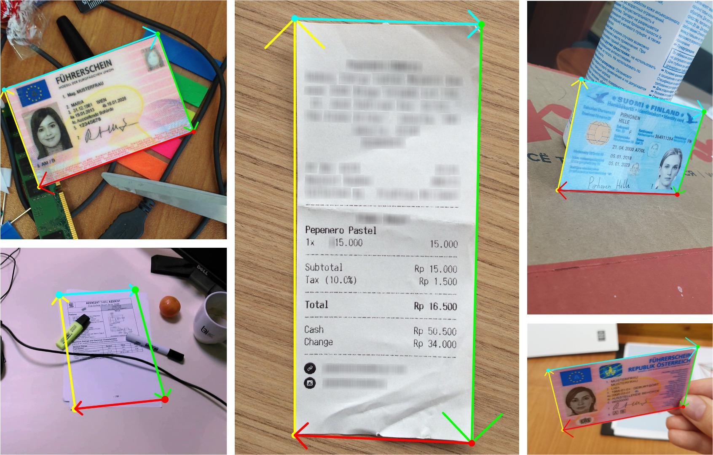
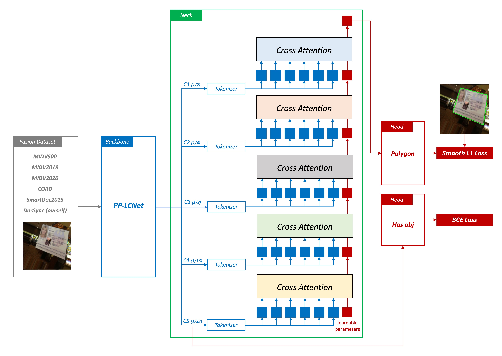
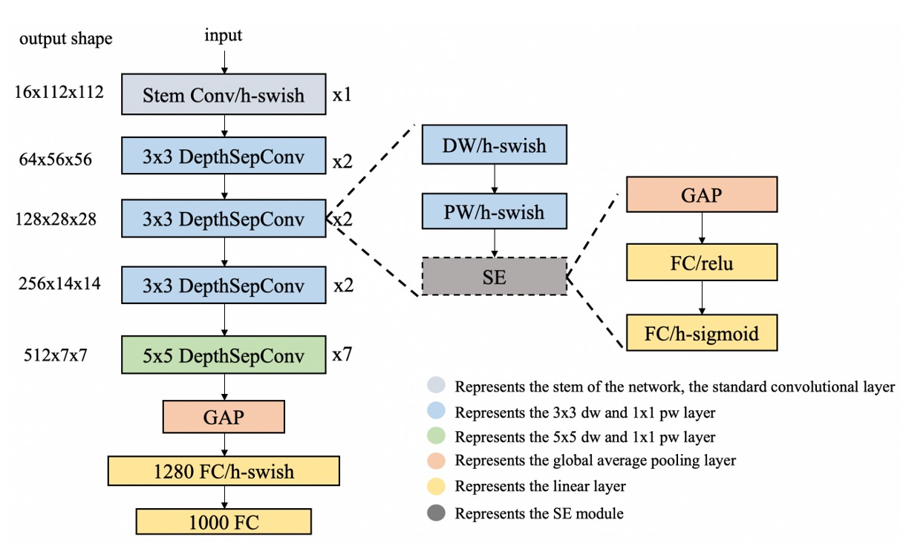
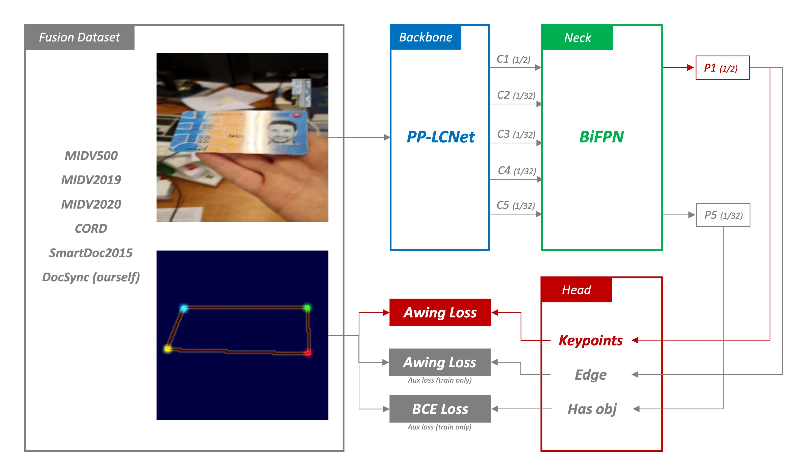
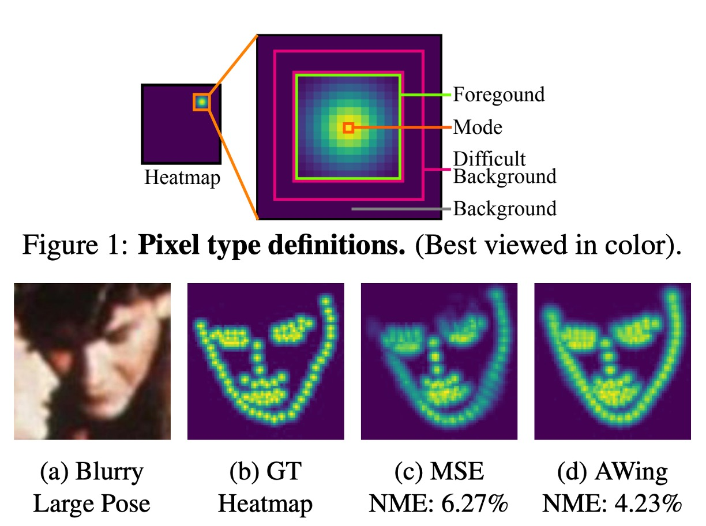

[English](./README.md) | **[中文](./README_tw.md)**

# DocAligner

<p align="left">
    <a href="./LICENSE"></a>
    <a href="https://github.com/DocsaidLab/DocAligner/releases"></a>
    <a href=""></a>
</p>

## 介紹

<div align="center">
    
</div>

此模型專門設計來辨識圖像中的文件，精確地找到文件的四個角點，讓使用者可以將其攤平，以便進行後續的文字辨識或其他處理。

在技術層面，我們選擇了 PyTorch 作為訓練框架，並在推論時將模型轉換為 ONNX 格式，以便在不同平台上部署。此外，我們使用 ONNXRuntime 進行模型推論，這使得我們的模型能在 CPU 和 GPU 上高效運行。

## 技術文件

由於本專案的相關使用方式和設定的說明佔據非常多的篇幅，因此我們謹摘要「模型設計」的部分放在這裡。

套件安裝和使用的方式，請參閱 [**DocAligner Documents**](https://docsaid.org/docs/docaligner/)。

## 模型測試

我們提供網頁版的模型測試，可以初步測試模型的效果。

- [**DocAligner Web Demo**](https://docsaid.org/playground/docaligner-demo)

若你有客製化的需求，歡迎來信與我們討論：

- **docsaidlab@gmail.com**

## 模型設計

我們參考過去的研究文獻，首先考慮了點回歸模型。

### 點回歸模型



點回歸模型是我們最早期的版本，它的基本架構分成四個部分：

1. **特徵提取**

   

   這部分主要是用來將影像轉換成向量，這裡使用了 [**PP-LCNet**](https://arxiv.org/abs/2109.15099) 作為特徵提取器。

   輸入影像為 128 x 128 的 RGB 影像，經過特徵提取器後，輸出一個 256 維的向量。

2. **Cross-Attention**

   在此模型中，我們將 Neck 部分是用於增強從 Backbone 流出的特徵。

   在這個模型中，我們使用了 Cross-Attention 機制，這是一種 Transformer 中常用的機制，能夠捕捉不同特徵之間的關係，並將這些關係應用於特徵的增強。我們預期 Cross-Attention 能夠幫助模型理解圖像中不同點之間的空間關係，從而提高預測的準確性。除了 Cross-Attention 之外，我們還使用了位置編碼（positional encodings），這些編碼有助於模型理解圖像中點的空間位置，從而提高預測的準確性。

   我們考慮點回歸的特性，對於精確的像素定位，非常依賴於低級的特徵。因此我們從深層特徵開始，依序往淺層特徵（1/32 -> 1/16 -> 1/8 -> 1/4 -> 1/2）進行查詢，這樣的設計能夠讓模型在不同尺度的特徵中找到文件的位置。我們認為這種查詢方式能夠有效地提高模型的準確性。

3. **Point Regression**

   在預測頭的設計中，我們僅使用一個簡單的線性層作為 Head，將特徵轉換為點的坐標。我們希望模型可以更依賴於 Cross-Attention 的特徵的表達能力，而不是依賴於複雜頭部架構。

4. **Smooth L1 Loss**

   在我們的模型中，我們選擇使用 Smooth L1 Loss 作為損失函數，這是一種在回歸任務中常用的損失函數，特別適用於處理存在異常值的情況。

   與 L1 Loss 相比，Smooth L1 Loss 在預測值與真實值差異較大時更加穩健，能夠減少異常值對模型訓練的影響。此外，為了降低點回歸的放大誤差，我們將點預測的權重「提高至 1000」，經過我們的實驗，這樣的設計能夠有效地提高模型的準確性。

   除了角點的損失之外，我們也用了其他的損失，包括：

   - Classification Loss: 這是一種用於分類的損失函數，用於預測圖像中是否存在文件，使用 BCE Loss。

   請注意，這裡的分類損失並非只是輔助損失，而是主要損失之一，因為角點預測本身的限制，當遇到沒有目標物的情況時，仍會預測出角點，因此在部署階段，我們需要分類頭來告訴我們是否有目標物。

### 災難性失敗

在「點回歸模型」的架構中，我們遭遇了非常嚴重的「**放大誤差**」問題。

這個問題的根源在於，我們訓練模型的過程中，需要縮小原始圖像至 128 x 128 或 256 x 256。這樣的縮小過程，會導致原始圖像中的細節信息丟失，進而導致模型在預測時，無法準確地找到文件的角點。

**正確來說，模型會找到基於縮小圖像的角點。**

然後我們必須將這些角點放大至原始圖像的尺寸，才能找到原始圖像中的角點位置。

這樣的放大過程，會導致角點的位置出現大約 5 ~ 10 像素的偏移量，進而導致模型無法準確地預測文件的位置。

- **Note:** 你可以想像在原始圖像中，目標角點的方圓 10 像素的圖像，在預測時都會縮小到 1 像素。然後模型作出預測，最後在放大過程中，就會導致角點的位置出現偏移。

### 其他人怎麼做？

遇到這個問題後，我們開始有意識地去尋找其他人是如何解決這個問題的。

後來發現在該領域 (Document Localization) 的許多文獻中，解決方式就是：

1. **使用大圖預測**

   這樣的做法，可以保證模型在預測時，能夠準確地找到文件的角點。

   但是很慢，非常非常慢。

2. **引入錨點和偏移量**

   錨點（Anchor-Based）的做法可以參考物件偵測的領域，我們會需要一些先驗知識，用來定義 Anchor 的尺寸。但是文件出現在影像中可以是任意角度和形變，而錨點的設計會讓模型的偵測能力限縮在一定範圍內。

   基本上，你所知道的有關錨點架構的優缺點，都可以在這裡重寫一次。

   現實世界中的文件長寬比過於隨意，因此不適合使用錨點的設計。

3. **直接擬合評估數據集**

   比較早期的論文中，論述邏輯比較像是直接針對 SmartDoc 2015 設計一套算法，而不是設計一個通用的模型。

   在近幾年的論文中，則是會將 SmartDoc 2015 自行拆分訓練集和測試集，透過這種方式來提昇對於 SmartDoc 2015 的分數。

   所以你會在 Benchmark 的結果中看到有許多架構的分數相當不錯，但是在實際應用中，沒有足夠的泛化能力。

---

我們發現這個領域的研究者，對於這個問題的解決方式，並沒有一個統一的看法。

### 熱圖回歸模型



這個模型架構沿用了原本的特徵提取器，但是修改了 Neck 和 Head 部分。

1. **特徵提取**

   除了用來放在手機上的模型採用 LCNet 之外，我們還使用了一個更大的模型，用來提取更多的特徵。因為我們希望可以做出超越 SoTA 的模型，單純使用 LCNet 是不夠的。

   在這個模型中，我們嘗試使用了 FastViT、MobileNetV2 等，還算「輕量」的卷積神經網絡，特別適用於在計算資源受限的環境下進行高效的特徵提取。我們預期 Backbone 應該能從輸入數據中提取出足夠的特徵信息，為後續的熱圖回歸做好準備。

2. **BiFPN**

   接著我們為了更好地融合多尺度的特徵，我們引入了 BiFPN (Bidirectional Feature Pyramid Network) 通過上下文信息的雙向流動，增強了特徵的表達能力。我們預期 BiFPN 會產生一系列尺度豐富且語義強的特徵圖，這些特徵圖對於捕捉不同尺度的對象非常有效，並對最終的預測精度有正面影響。

3. **Heatmap Regression**

   

   為了解決之前提到的放大誤差，我們需要對預測的結果有一定的「模糊性」。意思是：我們不能讓模型準確地指出這個文件的角點在哪裡，而是應該要讓模型說：「**這個文件的角點大概在這個區域**」。

   為此，我們找來了常用於人臉關鍵點檢測或人體姿勢估計的方法：**熱圖回歸**。

   熱圖回歸將生成物體的熱圖表示，這些熱圖反映了物體出現在不同位置的可能性。通過分析這些熱圖，模型能夠準確地預測出物體的位置和姿態。而在我們的情境中，熱圖則是用來找到文件的角點。

4. **Adaptive Wing Loss**

   Loss 是模型訓練的關鍵，負責計算模型預測結果和真實標籤之間的差異。

   在這個模型中，我們使用的是 Adaptive Wing Loss，這是一種專門用於人臉關鍵點檢測的損失函數，這種方法是針對熱圖回歸中的損失函數進行創新，特別適用於人臉對齊問題。其核心思想是讓損失函數能夠根據不同類型的真實熱圖像素調整其形狀，對前景像素（即人臉特徵點附近的像素）施加更多的懲罰，而對背景像素施加較少的懲罰。

   在這裡，我們將文件角點預測的問題視為人臉關鍵點檢測問題，並使用專門用於人臉關鍵點檢測的損失函數。我們認為這種方法能夠有效地解決文件角點檢測中的問題，並且能夠在不同的場景中取得良好的效果。

   - **Reference:** [**Adaptive Wing Loss for Robust Face Alignment via Heatmap Regression**](https://arxiv.org/abs/1904.07399)

   除了角點的損失之外，我們也用了多個輔助的損失，包括：

   - **Edge Loss:** 這裡同時監督物體邊界訊息，使用 AWing Loss。
   - **Classification Loss:** 這裡用於預測圖像中是否存在文件，使用 BCE Loss。

### 解決放大誤差

熱圖回歸模型的輸出就是一張熱圖，這張熱圖可以告訴我們文件的角點大概在哪裡。

接著，我們**不能直接使用這張熱圖**，因為這張熱圖是縮小過的，實際上應該要這樣：

1. 我們需要將這張熱圖放大至原始圖像的尺寸。
2. 使用影像後處理的方式，找到每個熱圖中提示的角點區域的 Contour。
3. 計算 Contour 的質心，這個質心就是文件的角點。

如此一來，模型就能夠準確地找到角點，解決了之前提到的放大誤差問題。

## 結論

你可以在熱圖模型的架構中找到一個很明顯的缺點：

- **不是端到端的模型架構**

這也是我們在設計模型時，一直在思考的問題。我們希望能夠設計一個端到端的模型，這樣對於使用者來說更簡單，模型也可以對每個組件進行學習。但是基於點回歸模型遇到的困難，我們不得不使用熱圖回歸模型的設計方式。

總之，雖然不是那麼完美，但至少先解決了放大誤差問題。

在我們的熱圖模型實驗中，使用更大的 Backbone、更複雜的 Neck 都能提高模型的準確性。

在部署階段，你只需要考慮到使用場景中的算力限制，挑選合適的模型即可。

## 引用

我們感謝所有走在前面的人，他們的工作對我們的研究有莫大的幫助。

如果您認為我們的工作對您有幫助，請引用我們的專案：

```bibtex
@misc{yuan2023docaligner,
  author = {Ze Yuan},
  title = {DocAligner},
  year = {2023},
  publisher = {GitHub},
  url = {https://github.com/DocsaidLab/DocAligner},
  note = {GitHub repository}
}
```
