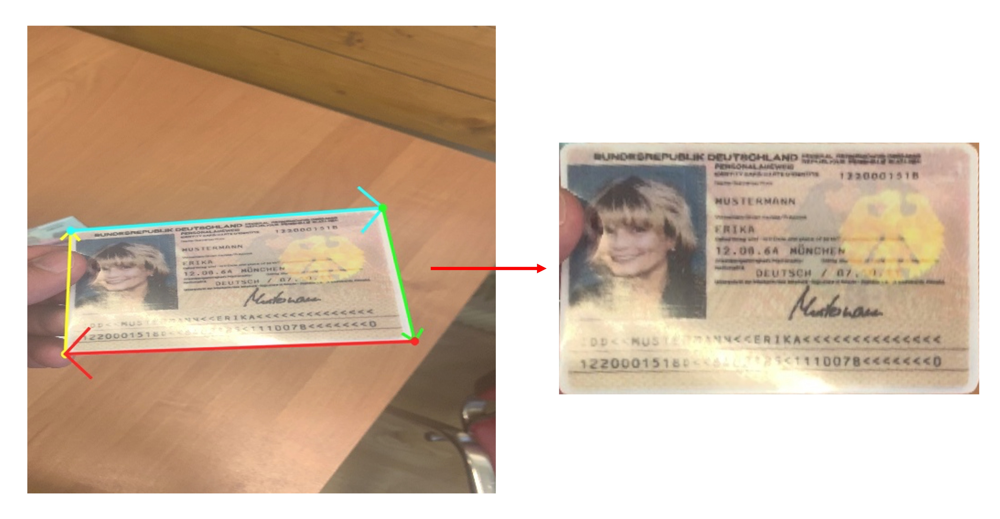
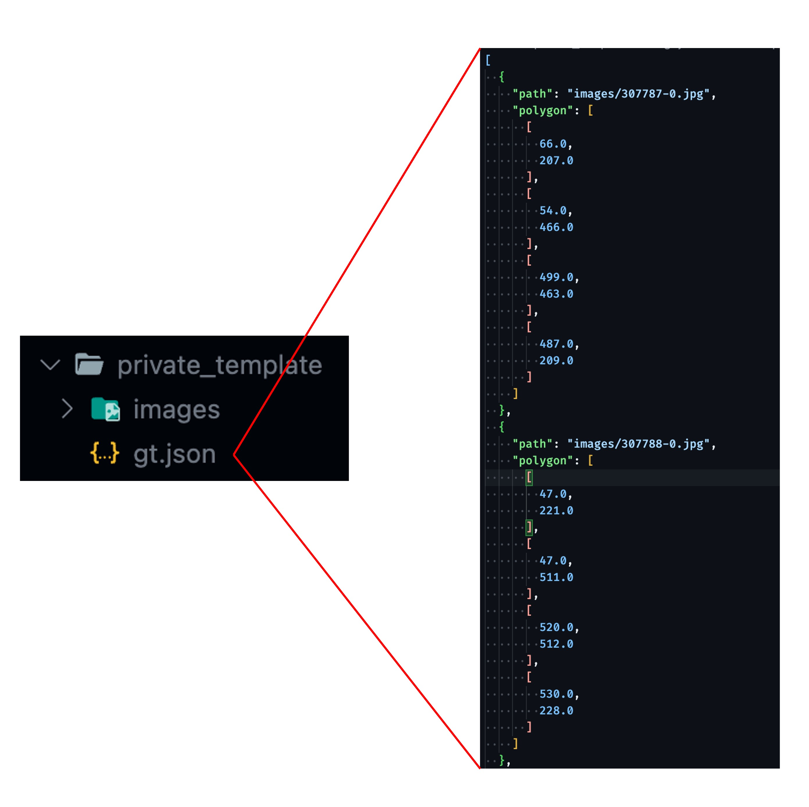

[English](./README.md) | **[中文](./README_tw.md)**

# DocAligner

<p align="left">
    <a href="./LICENSE"></a>
    <a href="https://github.com/DocsaidLab/DocAligner/releases"></a>
    <a href=""></a>
    <a href="https://doi.org/10.5281/zenodo.10442508"></a>
</p>

## 介紹

<div align="center">
    
</div>

本項目旨在開發一種視覺系統，專門用於圖像中文件的精確定位。我們的核心目標是準確預測文件的四個角點位置。此技術主要適用於金融科技、銀行業和共享經濟等行業，能有效降低圖像處理和文字分析任務的錯誤率及計算需求。

該系統的核心功能稱為「文件定位」（Document Localization）。我們的模型專門設計來識別圖像中的文件，並將其攤平，以便進行後續的文字識別或其他處理。我們提供兩種不同的模型：「熱圖模型」和「點回歸模型」，各具特點和適用場景，這些將在後續章節中詳細介紹。

在技術層面，我們選擇了 PyTorch 作為訓練框架，並使用 ONNXRuntime 進行模型推論，這使得我們的模型能在 CPU 和 GPU 上高效運行。此外，我們支持將模型轉換為 ONNX 格式，方便在不同平台上部署。對於需要量化的場景，我們提供基於 ONNXRuntime API 的靜態量化模型功能。

我們的模型在性能上達到接近最先進（SoTA）水平，並在實際應用中展示了即時（Real-Time）的推論速度，使其能夠滿足大多數應用場景的需求。

---

## 目錄

- [介紹](#介紹)
- [目錄](#目錄)
- [快速開始](#快速開始)
- [評估模型（Benchmark）](#評估模型benchmark)
- [資料集介紹](#資料集介紹)
- [提交資料集](#提交資料集)
- [常見問題（FAQs）](#常見問題faqs)
- [引用](#引用)

---

## 快速開始

### 安裝

目前我們沒有提供 Pypi 上的安裝包，若要使用本專案，您可以直接從 Github 上 clone 本專案，然後安裝相依套件，安裝前請確認您已經安裝了 [DocsaidKit](https://github.com/DocsaidLab/DocsaidKit)。

若已經安裝 DocsaidKit，請按照以下步驟進行：

1. Clone 專案：

   ```bash
   git clone https://github.com/DocsaidLab/DocAligner.git
   ```

2. 進入專案目錄：

   ```bash
   cd DocAligner
   ```

3. 建立打包文件：

   ```bash
   python setup.py bdist_wheel
   ```

4. 安裝打包文件：

   ```bash
   pip install dist/docaligner-*-py3-none-any.whl
   ```

遵循這些步驟，您應該能夠順利完成 DocAligner 的安裝。

安裝完成後即可以使用本專案。

---

### 導入必要的依賴項

我們提供了一個簡單的模型推論介面，其中包含了前後處理的邏輯。

首先，您需要導入所需的相關依賴並創建 DocAligner 類別。


```python
import docsaidkit as D
from docsaidkit import Backend
from docaligner import DocAligner, ModelType
```

### ModelType

`ModelType` 是一個枚舉類型，用於指定 DocAligner 使用的模型類型。它包含以下選項：

- `heatmap`：使用熱圖模型進行文件對齊。
- `point`：使用點檢測模型進行文件對齊。

未來可能會有更多的模型類型，我們會在此處更新。

### Backend

`Backend` 是一個枚舉類型，用於指定 DocAligner 的運算後端。它包含以下選項：

- `cpu`：使用 CPU 進行運算。
- `cuda`：使用 GPU 進行運算（需要適當的硬體支援）。

ONNXRuntime 支援了非常多的後端，包括 CPU、CUDA、OpenCL、DirectX、TensorRT 等等，若您有其他需求，可以參考 [**ONNXRuntime Execution Providers**](https://onnxruntime.ai/docs/execution-providers/index.html)，並自行修改成對應的後端。

### 創建 DocAligner 實例

```python
model = DocAligner(
    gpu_id=0,  # GPU 編號，如果不使用 GPU 請設為 -1
    backend=Backend.cpu,  # 選擇運算後端，可以是 Backend.cpu 或 Backend.cuda
    model_type=ModelType.point  # 選擇模型類型，可以是 ModelType.heatmap 或 ModelType.point
)
```

注意事項：

- 使用 cuda 運算除了需要適當的硬體支援外，還需要安裝相應的 CUDA 驅動程式和 CUDA 工具包。如果您的系統中沒有安裝 CUDA，或安裝的版本不正確，則無法使用 CUDA 運算後端。

- 關於 onnxruntime 安裝依賴相關的問題，請參考 [ONNXRuntime Release Notes](https://onnxruntime.ai/docs/execution-providers/CUDA-ExecutionProvider.html#requirements)

### 讀取和處理圖像

```python
# 讀取圖像
img = D.imread('path/to/your/image.jpg')

# 您也可以使用我們提供的測試圖像
# img = D.imread('docs/run_test_card.jpg')

# 使用模型進行推論
result = model(img) # result 是一個 Document 類型
```

### 輸出結果

您得到的推論結果是經過我們包裝的 `Document` 類型，它包含了文件的多邊形、OCR 文字資訊等等。

在這個模組中，我們不會用到 OCR 相關的功能，因此我們只會使用 `image` 和 `doc_polygon` 屬性。獲取到推論結果後，您可以進行多種後處理操作。

#### 繪製文件多邊形

```python
# 繪製並保存帶有文件多邊形的圖像
result.draw_doc('path/to/save/folder', 'output_image.jpg')
```

或不指定保存路徑，則會在當前目錄下保存，並自動給定一個時序編號。

```python
result.draw_doc()
```

#### 取得繪製後的 numpy 圖像

使用 `draw_doc` 功能預設會保存 JPG 格式的圖像，如果您有其他需求，可以使用 `gen_doc_info_image` 方法，之後再自行處理。

```python
img = result.gen_doc_info_image()
```

#### 提取攤平後的文件圖像

如果您知道文件的原始大小，即可以使用 `gen_doc_flat_img` 方法，將文件圖像根據其多邊形邊界轉換為矩形圖像。

```python
H, W = 1080, 1920
flat_img = result.gen_doc_flat_img(image_size=(H, W))
```

如果是一個未知的影像類別，也可以不用給定 `image_size` 參數，此時將會根據文件多邊形的邊界自動計算出最小的矩形圖像，並將最小矩形的長寬設為 `H` 和 `W`。

```python
flat_img = result.gen_doc_flat_img()
```

#### 將文件資訊轉為 JSON

如果您需要將文件資訊保存到 JSON 檔案中，可以使用 `be_jsonable` 方法。

轉換時，可以考慮將影像剔除，以節省空間，預設使用 `exclude_image=True`。

```python
doc_json = result.be_jsonable()
D.dump_json(doc_json)
```

#### 範例

```python
import docsaidkit as D
from docaligner import DocAligner

model = DocAligner(D.Backend.cpu)
img = D.imread('docs/run_test_card.jpg')
result = model(img)

# You can draw the result by yourself.
output_img = D.draw_polygon(img, result.doc_polygon)
flat_img = result.gen_doc_flat_img(image_size=(480, 800))
D.imwrite(output_img)
D.imwrite(flat_img)

# Or you can draw the colorful image from `draw_doc` method.
# result.draw_doc()
```

<div align="center">
    
</div>

---

## 評估模型（Benchmark）

我們使用了 [SmartDoc 2015](https://github.com/jchazalon/smartdoc15-ch1-dataset) 資料集作為我們的測試資料集。

### 評估協議

我們使用 **Jaccard Index** 作為衡量標準，這個指數總結了不同方法在正確分割頁面輪廓方面的能力，並對那些在某些畫面中未能檢測到文件對象的方法進行了懲罰。

評估過程首先是利用每個畫面中文件的大小和坐標，將提交方法 S 和基準真實 G 的四邊形坐標進行透視變換，以獲得校正後的四邊形 S0 和 G0。這樣的變換使得所有的評估量度在文件參考系內是可比的。對於每個畫面 f，計算 Jaccard 指數 (JI)，這是一種衡量校正四邊形重疊程度的指標，計算公式如下：


$$ JI(f) = \frac{\text{area}(G0 \cap S0)}{\text{area}(G0 \cup S0)} $$


其中 $` \text{area}(G0 \cap S0) `$ 定義為檢測到的四邊形和基準真實四邊形的交集多邊形，$` \text{area}(G0 \cup S0) `$ 則為它們的聯集多邊形。每種方法的總體分數將是測試數據集中所有畫面分數的平均值。

### 執行評估

我們提供了一個簡單的評估模組，可以用於評估模型於 SmartDoc2015 的效果。

請在執行前確認您已經下載了 `SmartDoc2015` 資料集，並且放置在 `/data/Dataset` 目錄下。不放在此目錄下也可以，但是需要修改 `DocAligner/docker/benchmark.bash` 腳本中的 `-v /data/Dataset:/data/Dataset` 對應路徑。

```bash
# 輸入內容依序為：
# 執行目標 bash、資料集名稱、模型類型、模型名稱。
bash DocAligner/docker/benchmark.bash smartdoc heatmap lcnet050
```

### 評估結果

<div align="center">

| Models | bg01 | bg02 | bg03 | bg04 | bg05 | Overall |
| :---: | :---: | :---: | :---: | :---: | :---: | :---: |
| HReg-FastViT_SA24-BiFPNx3-256 (Ours) |  0.9944 |  0.9932 |  0.9940 |  0.9937 |  0.9929 |  0.9937 |
| HReg-MBV2_100-BiFPNx3-256 (Ours) |  0.9917 |  0.9901 |  0.9921 |  0.9899 |  0.9891 |  0.9909 |
| HReg-FastViT_T8-BiFPNx3-256 (Ours) |  0.9920 |  0.9894 |  0.9918 |  0.9896 |  0.9888 |  0.9906 |
| HReg-LC100-BiFPNx3-256 (Ours) |  0.9908 |  0.9877 |  0.9905 |  0.9894 |  0.9854 |  0.9892 |
| HReg-LC100-FPNx3-256 (Ours) |  0.9899 |  0.9865 |  0.9912 |  0.9884 |  0.9848 |  0.9886 |
| HReg-LC050-BiFPNx3-256 (Ours) |  0.9847 |  0.9822 |  0.9865 |  0.9811 |  0.9722 |  0.9826 |
| HReg-LC050-FPNx6-256 (Ours) |  0.9722 |  0.9744 |  0.9803 |  0.9739 |  0.9553 |  0.9732 |
| PReg-LC050-XAtt-256 (Ours) |  0.9663 |  0.9606 |  0.9664 |  0.9630 |  0.9199 |  0.9596 |
| - | - | - | - | - | - | - |
| HU-PageScan [1] | - | - | - | - | - | 0.9923 |
| Advanced Hough [2] |  0.9886 |  0.9858 |  0.9896 |  0.9806 |  - |  0.9866 |
| LDRNet [4] | 0.9877 | 0.9838 | 0.9862 | 0.9802 | 0.9858 | 0.9849 |
| Coarse-to-Fine [3] |  0.9876 |  0.9839 |  0.9830 |  0.9843 |  0.9614 |  0.9823 |
| SEECS-NUST-2 [3] |  0.9832 |  0.9724 |  0.9830 |  0.9695 |  0.9478 |  0.9743 |
| LDRE [5] | 0.9869 | 0.9775 | 0.9889 | 0.9837 | 0.8613 | 0.9716 |
| SmartEngines [5] |  0.9885 |  0.9833 |  0.9897 |  0.9785 |  0.6884 |  0.9548 |
| NetEase [5] |  0.9624 |  0.9552 |  0.9621 |  0.9511 |  0.2218 |  0.8820 |
| RPPDI-UPE [5] |  0.8274 |  0.9104 |  0.9697 |  0.3649 |  0.2162 |  0.7408 |
| SEECS-NUST [5] |  0.8875 |  0.8264 |  0.7832 |  0.7811 |  0.0113 |  0.7393 |

</div>

1. **HU-PageScan** 是一個基於像素分類的切割模型，雖然他的效果比較好，但模型尺寸及運算量較大，且受限於模型架構，對於部分遮蔽的樣態抵抗力較低，例如手指抓著邊角的這種情境，無法滿足實務上的需求。
    - Paper: [HU-PageScan: a fully convolutional neural network for document page crop](https://ietresearch.onlinelibrary.wiley.com/doi/full/10.1049/iet-ipr.2020.0532) (2021.02)
    - Github: [HU-PageScan](https://github.com/ricardobnjunior/HU-PageScan)

2. **Advanced Hough** 是 CV-Based 的模型，雖然效果不錯，但是凡使用 CV-Based 的模型，都會有一些缺點，例如對於光線和角度的敏感度。
    - Paper: [Advanced Hough-based method for on-device document localization](https://www.computeroptics.ru/KO/PDF/KO45-5/450509.pdf) (2021.06)
    - Github:  [hough_document_localization](https://github.com/SmartEngines/hough_document_localization)

3. **Coarse-to-Fine** 和 **SEECS-NUST-2** 是一個基於深度學習的模型，採用了遞迴優化的策略，效果不錯，但是很慢。
    - Paper: [Real-time Document Localization in Natural Images by Recursive Application of a CNN](https://khurramjaved.com/RecursiveCNN.pdf) (2017.11)
    - Paper: [Coarse-to-fine document localization in natural scene image with regional attention and recursive corner refinement](https://sci-hub.et-fine.com/10.1007/s10032-019-00341-0) (2019.07)
    - Github:  [Recursive-CNNs](https://github.com/KhurramJaved96/Recursive-CNNs)

4. **LDRNet** 是一個基於深度學習的模型，我們有使用他們提供的模型進行測試，發現該模型完全擬合在 SmartDoc 2015 資料集上，對於其他場景完全沒有泛化能力。我們也試著加入其他資料進行訓練，最終的表現也不理想，可能是這個架構對與特徵融合的能力不足。
    - Paper: [LDRNet: Enabling Real-time Document Localization on Mobile Devices](https://arxiv.org/abs/2206.02136) (2022.06)
    - Github:  [LDRNet](https://github.com/niuwagege/LDRNet)

5. **LDRE**、**SmartEngines**、**NetEase**、**RPPDI-UPE**、**SEECS-NUST** 以下的模型都是基於 CV-Based 的模型。
    - Paper: [ICDAR2015 Competition on Smartphone Document Capture and OCR (SmartDoc)](https://marcalr.github.io/pdfs/ICDAR15e.pdf) (2015.11)
    - Github:  [smartdoc15-ch1-dataset](https://github.com/jchazalon/smartdoc15-ch1-dataset)

### 結果分析

- 雖然我們的模型可以達到接近 SoTA 的分數，但現實場景遠比這個資料集複雜，因此不用過於在意這個分數，我們只是想要證明我們的模型是有效的。

- 由於我們盡量減少模型的大小和運算量，因此在實驗中，我們發現模型對於 Zero-shot 的能力並不好，也就是說，模型對於新的場景，需要進行微調才能達到最佳效果。

- 經過實驗，我們發現「熱圖回歸模型」的穩定性遠高於「點回歸模型」，因此我們仍會推薦您使用熱圖模型。

- 我們預設使用 `FastViT_SA24` 作為熱圖模型的骨幹網路，因為它的效果和運算量都很好。您可以自行替換規模更大，準確度更高的骨幹網路。

- 經過實驗，`BiFPN`（3層） 效果仍優於 `FPN`（6層），因此我們推薦您使用 `BiFPN`。但是 `BiFPN` 有用到 `einsum` 的操作，可能會導致其他推論框架的困擾，因此若您在使用 `BiFPN` 時候遇到錯誤，可以考慮改為 `FPN` 模型。

- 儘管「熱圖回歸模型」表現穩定，但由於需要在高解析度的特徵圖上進行監督，因此模型的運算量遠高於「點回歸模型」。

- 但我們仍無法割捨「點回歸模型」的優點，包含但不限於：可以預測圖面範圍之外的角點；計算量低及快速簡單的後處理流程等。因此我們會持續優化「點回歸模型」，以提升其效果。

- 以下是模型的比較表格：

    | Model Name                    | ModelType | ModelCfg        |
    |:-----------------------------:|:---------:|:---------------:|
    | HReg-FastViT_SA24-BiFPNx3-256 | heatmap   | fastvit_sa24    |
    | HReg-MBV2-140-BiFPNx3-256     | heatmap   | mobilenetv2_140 |
    | HReg-FastViT_T8-BiFPNx3-256   | heatmap   | fastvit_t8      |
    | HReg-LC100-BiFPNx3-256        | heatmap   | lcnet100        |
    | HReg-LC100-FPNx3-256          | heatmap   | lcnet100_fpn    |
    | HReg-LC050-BiFPNx3-256        | heatmap   | lcnet050        |
    | HReg-LC050-FPNx6-256          | heatmap   | lcnet050_fpn    |
    | PReg-LC050-XAtt-256           | point     | lcnet050        |

    | Model Name                    | Parameters (M) | FP32 Size (MB) | FLOPs(G) | Overall Score |
    |:-----------------------------:|:--------------:|:--------------:|:--------:|:-------------:|
    | HReg-FastViT_SA24-BiFPNx3-256 |     20.8       |     83.1       |   8.5    |     0.9937    |
    | HReg-MBV2-140-BiFPNx3-256     |      3.7       |     14.7       |   2.4    |     0.9909    |
    | HReg-FastViT_T8-BiFPNx3-256   |      3.3       |     13.1       |   1.7    |     0.9906    |
    | HReg-LC100-BiFPNx3-256        |      1.2       |      4.9       |   1.6    |     0.9892    |
    | HReg-LC100-FPNx3-256          |      1.1       |      4.5       |   1.4    |     0.9886    |
    | HReg-LC050-BiFPNx3-256        |      0.4       |      1.7       |   1.2    |     0.9826    |
    | HReg-LC050-FPNx6-256          |      0.4       |      1.7       |   1.6    |     0.9732    |
    | PReg-LC050-XAtt-256           |      1.1       |      4.5       |   0.22   |     0.9596    |

---

## 資料集介紹

- **SmartDoc 2015**
    - [**SmartDoc 2015**](https://github.com/jchazalon/smartdoc15-ch1-dataset)
    - Smartdoc 2015 - Challenge 1 資料集最初是為 Smartdoc 2015 競賽創建的，重點是評估使用智慧型手機的文件影像擷取方法。 Challenge 1 特別在於偵測和分割從智慧型手機預覽串流中擷取的視訊畫面中的文件區域。

- **MIDV-500/MIDV-2019**
   - [**MIDV**](https://github.com/fcakyon/midv500)
   - MIDV-500 由 50 個不同身分證明文件類型的500 個影片片段組成，包括 17 個身分證、14 個護照、13 個駕照和 6 個不同國家的其他身分證明文件，並具有真實性，可以對各種文件分析問題進行廣泛的研究。
   - MIDV-2019 資料集包含扭曲和低光影像。

- **MIDV-2020:**
   - [**MIDV2020**](http://l3i-share.univ-lr.fr/MIDV2020/midv2020.html)
   - MIDV-2020 包含 10 種文件類型，其中包括 1000 個帶註釋的影片剪輯、1000 個掃描影像和 1000 個獨特模擬身分文件的 1000 張照片，每個文件都具有唯一的文字欄位值和唯一的人工生成的面孔。

- **Indoor Scenes**
   - [**Indoor**](https://web.mit.edu/torralba/www/indoor.html)
   - 該資料集包含 67 個室內類別，總共 15,620 張圖像。圖像數量因類別而異，但每個類別至少有 100 張圖像。所有圖片均為 jpg 格式。

- **CORD v0**
   - [**CORD**](https://github.com/clovaai/cord)
   - 該資料集由數千張印尼收據組成，其中包含用於 OCR 的圖像文字註釋，以及用於解析的多層語義標籤。所提出的資料集可用於解決各種 OCR 和解析任務。

- **Docpool**
   - [**Docpool**](./data/docpool/)
   - 我們自行從網路收集各類文本影像，用在動態合成影像技術作為訓練資料集。

---

## 提交資料集

首先，我們非常感謝您願意提供資料集，我們會在第一時間進行測試和整合。

提交資料的格式範例如下：

<div align="center">
    
</div>

您可以看到，首先是一個資料集，內有您搜集的影像，並且在同一個目錄下，有一個 `gt.json` 檔案，裡面包含了每張影像的標籤。

標籤格式內容必須要有：

1. 影像相對路徑
2. 影像中文件的「四個角點的多邊形」邊界

    ```json
    [
        {
            "file_path": "path/to/your/image.jpg",
            "polygon": [
                [
                    [0, 0],
                    [0, 1080],
                    [1920, 1080],
                    [1920, 0]
                ]
            ]
        }
    ]
    ```

請注意上面所提到的資料格式與命名規範並不嚴格，大致上只要包含了影像路徑和多邊形邊界即可，但是為了方便我們進行測試，請盡量遵循上面的格式。

標籤資料我們會建議您使用 [LabelMe](https://github.com/labelmeai/labelme)，它是一個開源的標籤工具，可以幫助您快速標註影像，並且導出成 JSON 檔案。

建議您將資料上傳至您的 google 雲端，並透過[電子郵件](docsaidlab@gmail.com)提供給我們連結，我們會在收到您的資料後，盡快進行測試和整合。若您所提供的資料不符合我們的需求，我們會在第一時間通知您。

- **不符合需求的原因可能有**：
    - **資料集精度不足**：例如您的資料集中，有些影像的標籤不夠精確，或者有些影像的標籤是錯誤的。
    - **資料集標籤目標不明確**：我們要解決的問題是在影像中定位文件的四個角點，因此若您的資料中有超過「一個以上的目標」，或超過「四個以上的角點」，則無法使用。
    - **目標物太小**：若您的目標物太小，則我們建議您要重新考慮演算法的選擇，因為我們的模型並不適合處理小目標物，也跟我們便於後處理的目標不相符。
    - **資料集規模過於精緻**：就算您提供的資料只有數十張，我們也會欣然接受，但這樣的資料若用來擬合模型，則會造成過度擬合的問題，因此我們會建議您增加資料集的規模，以避免過度擬合的問題。

---

## 常見問題（FAQs）

1. **四個角點的順序是否重要？**
   - 不重要。我們的訓練過程會自動排序這些角點。

2. **標籤格式的要求有哪些？**
   - 格式上的要求不嚴格，只需包含影像路徑和多邊形邊界即可。但為了方便測試，建議盡量遵循標準格式。

3. **檔案名稱的重要性如何？**
   - 檔案名稱不是主要關注點，只要能正確連接到相應的影像即可。

4. **影像格式有何建議？**
   - 建議使用 jpg 格式以節省空間。

5. **標籤的精度對模型訓練的影響如何？**
   - 標籤精度極其重要，不精確的標籤會直接影響模型訓練的效果。

6. **標籤的目標物類型重要嗎？**
   - 是的，非常重要。
   - 目標物必須是文件，且每張影像中只能有一個目標物。

7. **目標物的大小對模型訓練有何影響？**
   - 目標物的大小很重要。我們的模型不適合處理小型目標物，因為這會影響後續處理的效率。

8. **如何定義「小目標物」？**
   - 以 1920x1080 解析度的影像為例，如果目標物小於 32 x 32 像素，則視為小目標物。具體計算公式為 `min(img_w, img_h) / 32`。

若需要更多幫助，請透過電子郵件與我們聯繫：**docsaidlab@gmail.com**

---

## 引用

我們感謝所有走在前面的人，他們的工作對我們的研究有莫大的幫助。

如果您認為我們的工作對您有幫助，請引用以下相關論文：

```bibtex
@misc{yuan2023docaligner,
  author = {Ze Yuan},
  title = {DocAligner},
  year = {2023},
  publisher = {GitHub},
  journal = {GitHub repository},
  doi = {10.5281/zenodo.10442508},
  howpublished = {\url{https://github.com/DocsaidLab/DocAligner}}
}

@misc{rw2019timm,
  author = {Ross Wightman},
  title = {PyTorch Image Models},
  year = {2019},
  publisher = {GitHub},
  journal = {GitHub repository},
  doi = {10.5281/zenodo.4414861},
  howpublished = {\url{https://github.com/rwightman/pytorch-image-models}}
}

@inproceedings{quattoni2009recognizing,
  title={Recognizing indoor scenes},
  author={Quattoni, Ariadna and Torralba, Antonio},
  booktitle={2009 IEEE conference on computer vision and pattern recognition},
  pages={413--420},
  year={2009},
  organization={IEEE}
}

@inproceedings{park2019cord,
  title={CORD: a consolidated receipt dataset for post-OCR parsing},
  author={Park, Seunghyun and Shin, Seung and Lee, Bado and Lee, Junyeop and Surh, Jaeheung and Seo, Minjoon and Lee, Hwalsuk},
  booktitle={Workshop on Document Intelligence at NeurIPS 2019},
  year={2019}
}

@article{arlazarov2019midv,
  title={MIDV-500: a dataset for identity document analysis and recognition on mobile devices in video stream},
  author={Arlazarov, Vladimir Viktorovich and Bulatov, Konstantin Bulatovich and Chernov, Timofey Sergeevich and Arlazarov, Vladimir Lvovich},
  journal={Компьютерная оптика},
  volume={43},
  number={5},
  pages={818--824},
  year={2019},
  publisher={Федеральное государственное автономное образовательное учреждение высшего~…}
}

@inproceedings{bulatov2020midv,
  title={MIDV-2019: challenges of the modern mobile-based document OCR},
  author={Bulatov, Konstantin and Matalov, Daniil and Arlazarov, Vladimir V},
  booktitle={Twelfth International Conference on Machine Vision (ICMV 2019)},
  volume={11433},
  pages={717--722},
  year={2020},
  organization={SPIE}
}

@article{bulatovich2022midv,
  title={MIDV-2020: a comprehensive benchmark dataset for identity document analysis},
  author={Bulatovich, Bulatov Konstantin and Vladimirovna, Emelianova Ekaterina and Vyacheslavovich, Tropin Daniil and Sergeevna, Skoryukina Natalya and Sergeevna, Chernyshova Yulia and Zuheng, Ming and Jean-Christophe, Burie and Muzzamil, Luqman Muhammad},
  journal={Компьютерная оптика},
  volume={46},
  number={2},
  pages={252--270},
  year={2022},
  publisher={Федеральное государственное автономное образовательное учреждение высшего~…}
}

@inproceedings{Wang_2019_ICCV,
author = {Wang, Xinyao and Bo, Liefeng and Fuxin, Li},
title = {Adaptive Wing Loss for Robust Face Alignment via Heatmap Regression},
booktitle = {The IEEE International Conference on Computer Vision (ICCV)},
month = {October},
year = {2019}
}

@inproceedings{tan2020efficientdet,
  title={Efficientdet: Scalable and efficient object detection},
  author={Tan, Mingxing and Pang, Ruoming and Le, Quoc V},
  booktitle={Proceedings of the IEEE/CVF conference on computer vision and pattern recognition},
  pages={10781--10790},
  year={2020}
}

@article{cui2021pp,
  title={PP-LCNet: A lightweight CPU convolutional neural network},
  author={Cui, Cheng and Gao, Tingquan and Wei, Shengyu and Du, Yuning and Guo, Ruoyu and Dong, Shuilong and Lu, Bin and Zhou, Ying and Lv, Xueying and Liu, Qiwen and others},
  journal={arXiv preprint arXiv:2109.15099},
  year={2021}
}

@inproceedings{vasufastvit2023,
  author = {Pavan Kumar Anasosalu Vasu and James Gabriel and Jeff Zhu and Oncel Tuzel and Anurag Ranjan},
  title = {FastViT: A Fast Hybrid Vision Transformer using Structural Reparameterization},
  booktitle={Proceedings of the IEEE/CVF International Conference on Computer Vision},
  year = {2023}
}

@inproceedings{burie2015icdar2015,
  title={ICDAR2015 competition on smartphone document capture and OCR (SmartDoc)},
  author={Burie, Jean-Christophe and Chazalon, Joseph and Coustaty, Micka{\"e}l and Eskenazi, S{\'e}bastien and Luqman, Muhammad Muzzamil and Mehri, Maroua and Nayef, Nibal and Ogier, Jean-Marc and Prum, Sophea and Rusi{\~n}ol, Mar{\c{c}}al},
  booktitle={2015 13th International Conference on Document Analysis and Recognition (ICDAR)},
  pages={1161--1165},
  year={2015},
  organization={IEEE}
}
```
