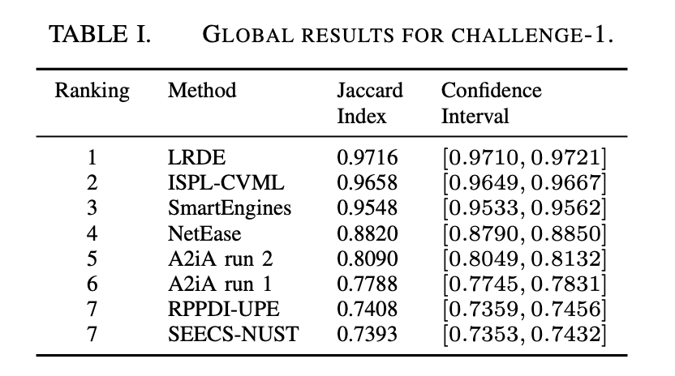
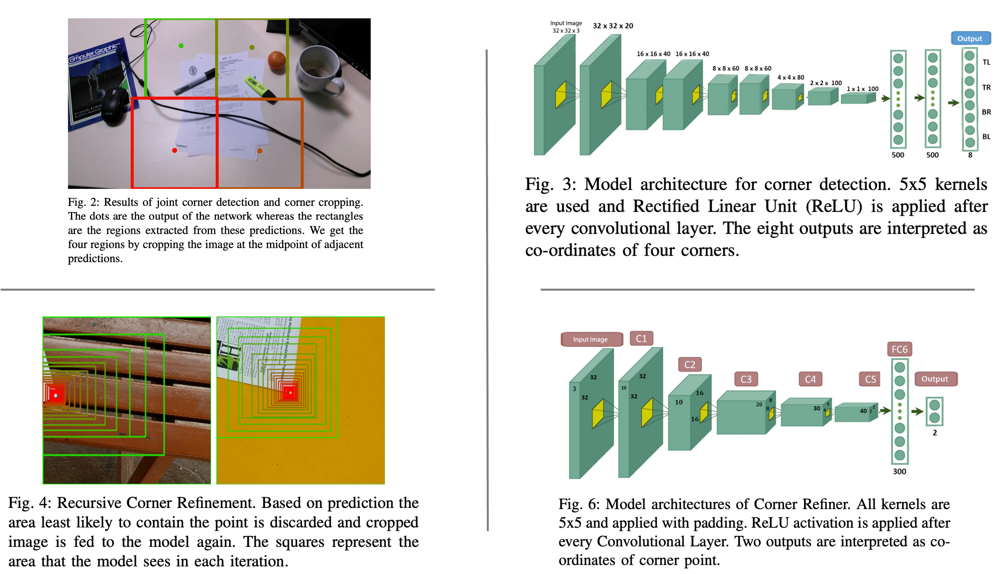
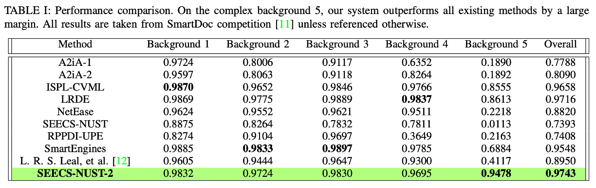
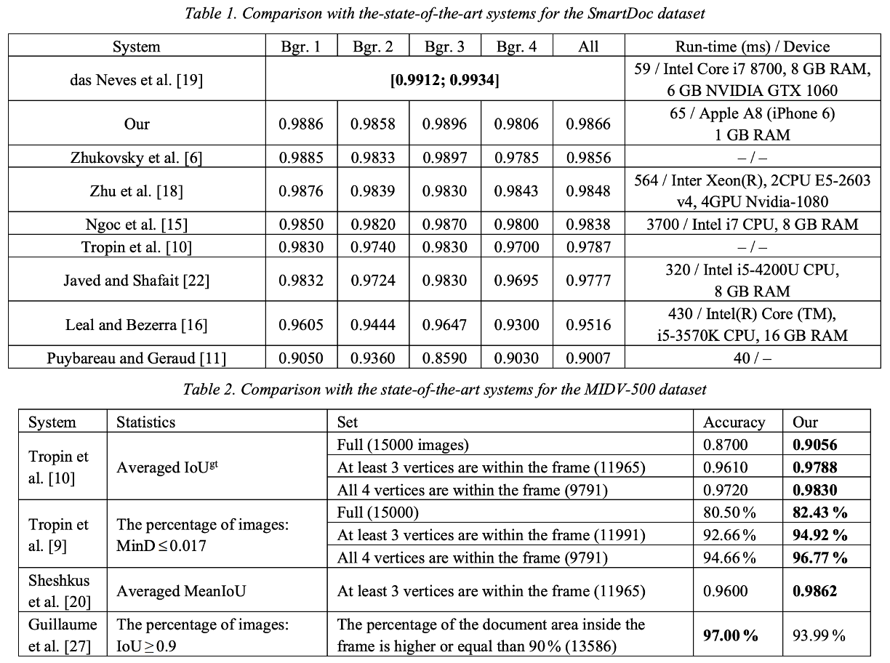
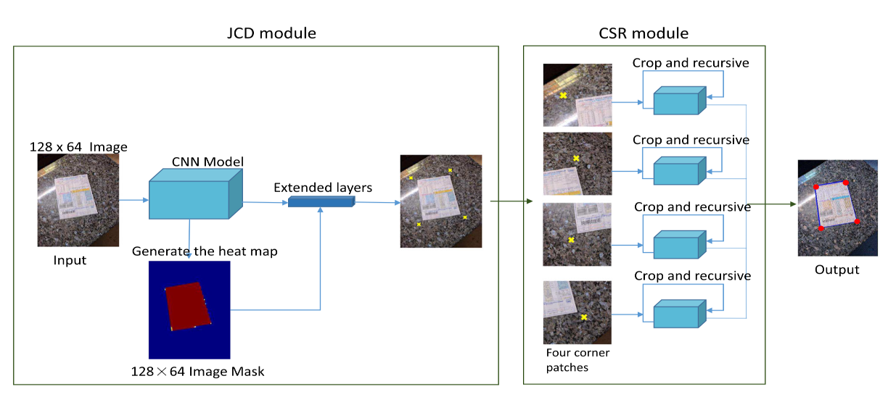
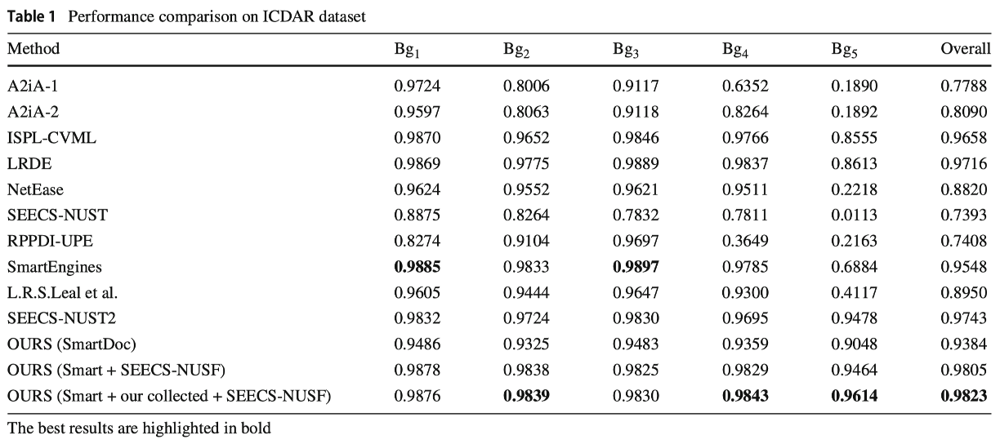
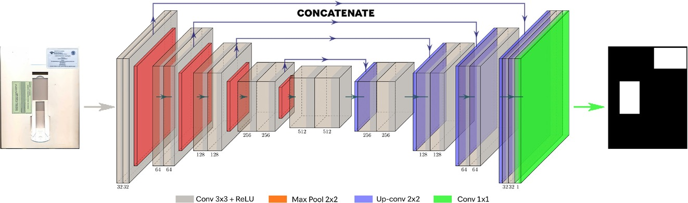
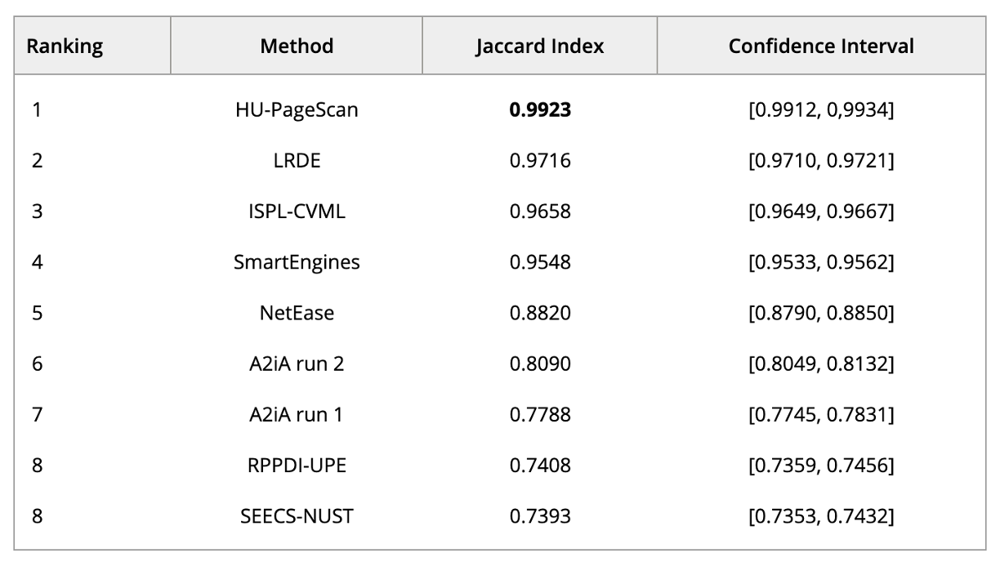
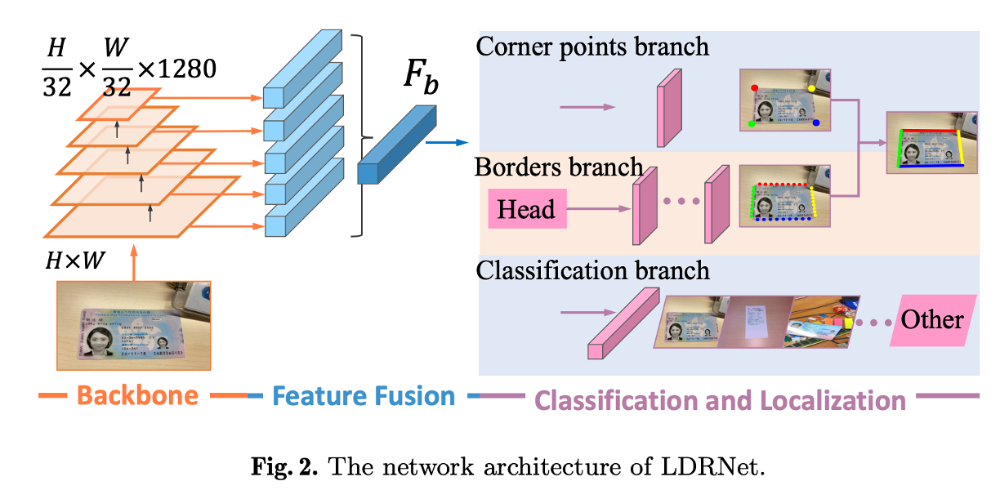
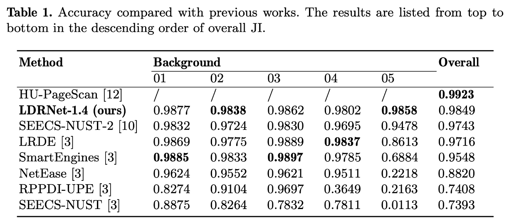

# Reference

## Table of Contents

- [SmartDoc2015](#smartdoc2015)
- [Real-time Document Localization in Natural Images by Recursive Application of a CNN](#real-time-document-localization-in-natural-images-by-recursive-application-of-a-cnn)
- [Advanced Hough-based method for on-device document localization](#advanced-hough-based-method-for-on-device-document-localization)
- [Coarse-to-fine document localization in natural scene image with regional attention and recursive corner refinement](#coarse-to-fine-document-localization-in-natural-scene-image-with-regional-attention-and-recursive-corner-refinement)
- [HU-PageScan: a fully convolutional neural network for document page crop](#hu-pagescan-a-fully-convolutional-neural-network-for-document-page-crop)
- [LDRNet: Enabling Real-time Document Localization on Mobile Devices](#ldrnet-enabling-real-time-document-localization-on-mobile-devices)

---

## SmartDoc2015

**Paper: [ICDAR2015 Competition on Smartphone Document Capture and OCR (SmartDoc)](https://marcalr.github.io/pdfs/ICDAR15e.pdf) (2015.11)**

**Github:  [smartdoc15-ch1-dataset](https://github.com/jchazalon/smartdoc15-ch1-dataset)**

這是一項針對智慧型手機文件捕捉和光學字符辨識（OCR）的比賽，稱為 ICDAR15 SMARTPHONE DOCUMENT CAPTURE AND OCR COMPETITION (SmartDoc)。比賽旨在評估智慧型手機在實際條件下捕捉文件影像的數位化過程中的兩個步驟。比賽面臨的主要挑戰包括背景移除、透視校正、照明標準化以及焦點或動作模糊。由於目前缺乏適合手機拍攝文件數位化的數據庫和基準，因此組織了這次比賽。

這次比賽共設有兩個獨立的挑戰：「智慧型手機文件定位」和「智慧型手機 OCR」。比賽提供了兩個新的數據集來進行評估，這些數據集涵蓋了真實條件下捕捉的文件並具有各種光度和幾何失真。比賽運行在開放模式下，參賽者提交他們在測試集上的系統結果，而非可執行文件。共收到了 13 份提交，其中 8 份針對「挑戰 1」，5 份針對「挑戰 2」。

這項比賽不僅對於手機捕捉的文件數位化決策過程產生了重要影響，而且也提供了公開可用的數據集（包括其真實情況），希望這些數據集能在未來多年內作為基準測試數位化方法之用。

### 數據集建立

為了構建數據集，研究者從公共數據庫中選取了六種不同類型的文件，每類選取五個文件影像。這些文件類型被選中的原因是它們涵蓋了不同的文件佈局方案和內容（完全文本或高圖形內容）。具體來說，這些文件包括來自 Ghega 數據集的數據表和專利文件、來自 MARG 數據集的醫學科學論文封面、來自 PRIMA 布局分析數據集的彩色雜誌頁面、來自 NIST 稅表數據集 (SPDB2) 的美國稅表以及來自 Tobacco800 文件影像數據庫的打字機打字信件。研究者對原始文件影像進行了一些小的噪音和邊緣移除處理，並將它們重新調整大小以適應 A4 紙張格式。

每份文件都是使用彩色激光打印機打印的，然後使用 Google Nexus 7 平板電腦進行拍攝。研究者為每30份文件錄製了大約10秒的小影片剪輯，在五種不同的背景情境中。這些影聘是以全高清 1920x1080 分辨率在可變幀率下錄製的。由於影片是手持移動平板電腦拍攝的，因此影片畫面呈現了實際的失真，例如焦點和動作模糊、透視、照明變化，甚至文件頁面的部分遮擋。總的來說，這個數據庫包含了 150 個影片剪輯，大約包含 25,000 個畫面。研究者通過半自動標註方式為這些收集的每個畫面標註了文件位置的四邊形坐標。

### 評估協議

本篇論文使用了 Jaccard 指數作為衡量標準，這個指數總結了不同方法在正確分割頁面輪廓方面的能力，並對那些在某些畫面中未能檢測到文件對象的方法進行了懲罰。

評估過程首先是利用每個畫面中文件的大小和坐標，將提交方法 S 和基準真實 G 的四邊形坐標進行透視變換，以獲得校正後的四邊形 S0 和 G0。這樣的變換使得所有的評估量度在文件參考系內是可比的。對於每個畫面 f，計算 Jaccard 指數 (JI)，這是一種衡量校正四邊形重疊程度的指標，計算公式如下：

$$ JI(f) = \frac{\text{area}(G0 \cap S0)}{\text{area}(G0 \cup S0)} $$

其中 $` \text{area}(G0 \cap S0) `$ 定義為檢測到的四邊形和基準真實四邊形的交集多邊形，$` \text{area}(G0 \cup S0) `$ 則為它們的聯集多邊形。每種方法的總體分數將是測試數據集中所有畫面分數的平均值。

### 比賽結果

在論文中，介紹投稿參賽之各隊伍的方法摘要：

1. **A2iA 第一隊**： 來自 A2iA 聖彼得堡、巴黎和 Teklia 巴黎的 C. Kermorvant、A. Semenov、S. Sashov 和 V. Anisimov。他們的方法首先使用 Canny 邊緣檢測器在 RGB 空間進行操作，然後用貝茲曲線插值檢測到的輪廓。根據對比度選擇某些輪廓，然後根據其正方形程度選擇四邊形。如果無法檢測到有效的四邊形，則在去噪的二值版本的輸入影像上應用一套類似的步驟。

2. **A2iA 第二隊**： A2iA 的第二種方法與第一隊相同，但沒有移除低對比度輪廓。

3. **ISPL-CVML**： 來自首爾國立大學和廣州大學的 S. Heo、H.I. Koo 和 N.I. Cho。他們的方法首先在降低分辨率的影像上應用線段檢測器 (LSD)，然後通過選擇最小化顏色和邊緣特徵的成本函數的兩個水平和垂直線段來生成文件邊界。最後在原始高解析度影像中完善文件邊界。

4. **LRDE**： 來自 EPITA 研究與開發實驗室的 E. Carlinet 和 T. Geraud。他們的方法依賴於一種名為形狀樹的影像層次結構表示。在影片的每個畫面中，計算樹上的能量以選擇最像紙張的形狀。能量涉及兩個衡量形狀符合四邊形程度和是否有如線條或圖像的子內容的術語。在轉換為 La*b* 空間的 L 和 b* 分量上計算兩棵形狀樹。兩棵樹中能量最高的形狀被保留為候選對象，最後根據前一幀的檢測位置來最終選擇正確的形狀。

5. **NetEase**： 來自 NetEase 的 P. Li、Y. Niw 和 X. Li。他們的方法首先使用 LSD 方法提取線段，這些線段隨後被分組，並通過選擇兩個水平和垂直線段組來形成四邊形。最終四邊形基於其寬高比、面積和內角選擇。

6. **RPPDI-UPE**： 來自伯南布哥大學和 Document Solutions 的 B.L.D. Bezerra、L. Leal 和 A. Junior。他們的方法首先使用 HSV 色彩空間，過濾色調通道以使文件頁面從背景中脫穎而出。接著進行形態學操作，再經由 Canny 邊緣檢測器和霍夫轉換產生一組候選多邊形。然後根據其形狀和位置過濾這些多邊形。

7. **SEECS-NUST**： 來自電氣工程與計算機科學學院和科技國立大學的 S.A. Siddiqui、F. Asad、A.H. Khan 和 F. Shafait。他們的方法首先在灰階影像上應用 Canny 邊緣檢測以獲得文件位置的初步估計。隨後分析不同顏色通道以確定哪個通道在文件和背景之間對比度更高，然後進行概率霍夫變換以獲得精確的文件分割。

8. **SmartEngines**： 來自莫斯科物理技術研究所、科學技術國立大學、俄羅斯科學院系統分析研究所和俄羅斯科學院信息傳輸問題研究所的 A. Zhukovsky、D. Nikolaev、V. Arlazarov、V. Postnikov、D. Polevoy、N. Skoryukina、T. Chernov、J. Shemiakina、A. Mukovozov、I. Konovalenko 和 M. Povolotsky。他們的方法從 LSD 算法提取線段開始，接著在這些線段上構建圖，並在應用了多種大小和角度過濾器後在該圖上進行四邊形選擇。最終的候選四邊形是通過使用基於 SURF 和 BRIEF 的局部描述符的幀間匹配策略來擬合動態模型，並使用卡爾曼濾波器來選擇的。

### 比賽總結

    

1. **LRDE 團隊表現最佳**：LRDE團隊提出的系統在這項任務中表現最佳，不僅提供了更高的平均結果質量，而且信心區間更窄，顯示出穩定的行為。

2. **ISPL-CVML 與 SmartEngines 團隊也表現出色**：這兩個團隊提出的系統同樣表現良好，特別是在像非常淺色背景（background04）和嚴重遮擋（background05）這樣的困難條件下。

3. **RPPDI-UPE 與 SEECS-NUST 團隊平分第七**：由於這兩個團隊在表一中呈現的95%信心區間重疊，因此它們在第七名中並列。

4. **領先方法的主要優勢**：領先方法的主要優勢在於三個共同階段：首先，這些方法依賴於非常穩健的形狀或線條提取過程，使得形成有效的形狀候選人成為可能；接著進行形狀過濾和選擇；最後，使用先前畫面的結果來改進最終決策。

5. **所有方法在數據集上的平均表現**：對所有方法在數據集上的平均表現進行分析時，可以觀察到幾個有趣的現象。首先，對捕捉條件（不同的“背景”）的性能研究顯示，低光條件（background03）並不是真正的挑戰，而淺色背景（background02和background04）更加困難。嚴重的遮擋（background05）是非常具有挑戰性的；其次，對文件類別的性能研究顯示，線條較多的文件（稅表的表格）以及像雜誌頁面這樣內容豐富的文件更具挑戰性。

---

## Real-time Document Localization in Natural Images by Recursive Application of a CNN

**Paper: [Real-time Document Localization in Natural Images by Recursive Application of a CNN](https://khurramjaved.com/RecursiveCNN.pdf) (2017.11)**

**Github:  [Recursive-CNNs](https://github.com/KhurramJaved96/Recursive-CNNs)**

傳統的圖像處理技術在面對極端視角和背景變化時並不穩固，因此需要一種更穩健的方法來準確定位影像中的文件。雖然有多種方法已被提出來解決這個問題，但它們大多依賴於這些傳統技術。作者提出，深度卷積神經網絡（CNNs）在物體檢測和分類任務中已顯示出對背景和視角變化的極高泛化性。因此，受到深度卷積神經網絡的泛化性和通用性的啟發，作者提出了一種新穎的基於CNN的方法，以實時準確地定位真實影像中的文件。

針對過去的研究，作者提出關於這些問題的分析：

1. **背景干擾**：自然影像中的文件通常包含放置文件時所在的表面，以及畫面中的其他非文件物體。這些背景因素可能會干擾文件的辨識和分割。

2. **透視扭曲**：由於手持相機拍攝，自然影像中的文件可能會出現透視扭曲，這對於文件的準確定位和數字化是一個挑戰。

3. **光線和照明變化**：自然光源和照明條件的變化可能對影像質量產生不利影響，尤其是在光線不均勻或陰影下拍攝時。

4. **運動模糊**：由於手持拍攝，可能會出現運動模糊，這進一步增加了影像處理的複雜性。

5. **文件與背景類型變化**：不同的文件和背景類型（如紋理、顏色、圖案等）增加了分割和定位文件的難度。

6. **實時處理的需求**：理想的數字化方法應該能在智慧型手機上實時運行，但傳統影像處理方法可能無法滿足這一需求，特別是在考慮到運算資源有限的情況下。

由於傳統的影像處理方法由於對環境做出了某些假設，因此在面對自然影像的複雜性和變化時可能具有一定的固有限制。作者提出的使用深度卷積神經網絡的方法旨在克服這些限制，提供更為普遍適用且泛化的文件數字化解決方案。

### 研究回顧

＊補充說明：論文前面的標籤序號 [X] 代表該論文在論文中的引用序號。

1. **早期方法**：最早的文件定位方法依賴於背景模型進行分割。這種方法通過拍攝無文件的背景，然後放置文件再拍攝，利用兩張圖片的差異來識別文件位置。但這種方法的缺點在於相機必須保持靜止，且需要拍攝兩張照片。

    - [2] H. Lampert H, T. Braun, et al. "Oblivious document capture and real-time retrieval." 2005.

2. **方法論**：自那以後，為這項任務提出了不同的方法，可以大致分為三類：基於相機校準的系統、基於文件內容分析的系統，以及基於幾何分析的系統。

    1. **相機校準系統**：這類系統利用相機相對於預期文件的位置和角度的信息來估計文件位置。但即使是最微小的視角或位置變化也需要重新校準，這使得這些系統對於手持設備來說不切實際。

        - [4] E Guillou, D. Meneveaux, et al. "Using vanishing points for camera calibration and coarse 3D reconstruction from a single image." 2000.
        - [5] C. Kofler, D. Keysers, et al. "Gestural Interaction for an Automatic Document Capture System." 2007.

    2. **文件內容分析技術**：這些技術通過定位影像中類似文本的區域來定位文件，並假設背景與文件對比是暗色和平淡的。但這種假設在含有圖形和花哨背景的文件（如小冊子）上經常失效。

        - [10] N. Stamatopoulos, B. Gatos, et al. "Automatic borders detection of camera document images." 2007.

    3. **幾何分析技術**：這些技術通過識別影像中的四邊形對象作為文件，對旋轉或透視扭曲具有泛化性。通常，這些技術首先識別影像中的線條，然後使用這些線條作為特徵來識別類似文件的四邊形。這些方法在文件缺乏直邊（例如頁面捲曲或不平整）時會失敗。

        - [6] P. Clark, M. Mirmehdi. "Rectifying perspective views of text in 3D scenes using vanishing points." 2003.
        - [7] S. Lu, M. Chen, et al. "Perspective rectification of document images using fuzzy set and morphological operations." 2005.
        - [9] L. Miao, S. Peng. "Perspective rectification of document images based on morphology." 2006.
        - [13] WH. Kim, Woong Hee, J. Hwang, et al. "Document capturing method with a camera using robust feature points detection." 2011.

3. **ICDAR 2015 SmartDoc比賽成果**：大量關於文件定位的工作是由於ICDAR 2015 SmartDoc比賽的結果。LRDE 是得分最高的方法，它以樹狀結構（形狀樹）分層表示影像，並根據能量選擇最像紙張的形狀。ISPL-CVML 方法則使用 LSD (線段檢測器)在降低解析度的影像上獲得水平和垂直線段，然後利用邊緣和顏色特徵選擇最可能的文件候選者。

    - [11] JC. Burie, J. Chazalon, et al. "ICDAR2015 competition on smartphone document capture and OCR (SmartDoc)." 2015.

4. **卷積神經網絡的應用**：卷積神經網絡已被用於與本研究類似的面部關鍵點檢測。然而，兩種方法存在一些基本差異。對於面部關鍵點檢測，作者使用了 23 個不同的網絡，分為三層進行預測。而在這項研究中，僅訓練了兩個網絡，並多次遞歸地應用於影像中的不同區域。

    - [17] Y. Sun, X. Wang, et al. "Deep convolutional network cascade for facial point detection." 2013.

### 模型架構

    

這篇文章提出的方法論主要涉及使用深度卷積神經網絡（CNN）來解決文件定位問題，特別是精確地檢測文件的四個角點。

1. **問題定義與關鍵點檢測**：
   - 將文件定位問題建模為關鍵點檢測問題。
   - 文件的四個角點（左上角TL、右上角TR、右下角BR、左下角BL）被定義為待檢測的四個關鍵點。

2. **兩階段方法**：

   - **第一階段**：使用類似 AlexNet 架構的深度卷積神經網絡同時預測文件的四個角點。

        1. **深度卷積神經網絡架構**：
            - 採用 8 層深度 CNN，包括兩個隱藏的全連接層和八個回歸頭，分別預測 TL、BR、BL 和 TR 的值。
            - 為了降低深度網絡的計算和記憶體成本，將影像縮放至 32x32 像素後輸入網絡。

        2. **挑戰與策略**：
            - 標準深度 CNN 在精確定位和分割任務上表現不佳，因為最後的卷積層只包含整個影像的高階特徵。
            - 由於對 32x32 影像的預測進行放大會導致較大誤差，因此模型的輸出不作為最終結果，而是用來從影像中提取包含四個角點的區域。

   - **第二階段**：通過遞迴應用淺層卷積神經網絡，分別對每個角點的預測進行精煉。

        1. **角點精煉網絡（Corner Refiner）**：
        - 每個 32x32 像素的影像被送入另一個具有兩個回歸頭的 CNN，此網絡被訓練來檢測包含單一角點的影像中的角點。
        - 由於單次預測無法達到精確檢測，因此多次使用 Corner Refiner 逐步逼近正確位置。

        2. **遞迴應用與影像裁剪**：
        - 在每次迭代中，根據模型在 32x32 影像上的預測，裁剪不太可能包含角點的全分辨率影像部分，然後將剩餘影像再次輸入同一網絡。
        - 定義了一個保留因子（RF）來決定每次迭代中應該保留的影像部分。經過多次迭代，影像被裁剪到相應的尺寸。
        - 當影像大小小於 10x10 像素時停止迭代

### 資料處理

1. **資料集準備**

    1. **資料集**：
        - 使用「ICDAR 2015 SmartDoc Challenge 1」資料集進行訓練和測試。
        - 資料集包含120個影片，每個影片約10秒長，涵蓋六種不同類型的文件，放置在五種不同的背景上。

    2. **數據劃分**：
        - 將每個影片的前 50% 畫面用於訓練，接下來的 20% 用於驗證，剩餘的 30% 用於測試。
        - 不隨機分割畫面到三個集合中，因為相鄰畫面幾乎相同，不應分在不同集合。

    3. **泛化能力測試**：
        - 從訓練、驗證和測試集中排除所有「稅表」文件的實例，以量化系統對未見過文件的泛化能力。
        - 為增加訓練集的變異性，另外收集 120 張圖像，並通過隨機旋轉、裁剪、改變對比度和亮度將這些圖像增強到 15,360 張。
        - 最終訓練集是 SmartDoc 訓練集和自收集圖像的聯集。

    4. **標籤處理**：
        - SmartDoc資料集提供了tl、tr、br、bl的標籤，但這些標籤的定義與作者的TL、TR、BR、BL不一致。
        - 根據作者的定義重命名標籤，以便於訓練。

2. **訓練細節**

    1. **模型準備**：
        - 將所有圖像隨機裁剪，確保每個裁剪後的圖像都有四個角點，然後將圖像大小調整為 32x32 像素。
        - 從訓練集計算影像平均值，在訓練和測試時從每個影像中減去這個平均值。
        - 為第二個模型，將每個影像裁剪成四個角點圖像，這些角點圖像的大小從 10x10 到最大可能尺寸，確保圖像只包含一個角點，並將所有圖像調整為 32x32 像素。

    2. **框架和超參數**：
        - 在 Tensorflow 中實現機器學習模型，使用 Python 和 Numpy 實現算法。
        - 模型權重從標準差為0.1的截斷正態分布初始化。
        - 在全連接層使用 0.8 的 Dropout，並使用 Adam 優化器最小化預測坐標和真實坐標之間的 L2 距離。
        - 角點精煉模型使用 1e-5 的學習率，聯合角點檢測模型使用 5e-4 的學習率。
        - 在將圖像輸入模型之前隨機改變亮度和對比度，以防止過度擬合。

### 實驗結果

    

---

## Advanced Hough-based method for on-device document localization

**Paper: [Advanced Hough-based method for on-device document localization](https://www.computeroptics.ru/KO/PDF/KO45-5/450509.pdf) (2021.06)**

**Github:  [hough_document_localization](https://github.com/SmartEngines/hough_document_localization)**

本論文主要探討的是如何在圖像中定位文件的問題。這個問題的具體描述是：

- 假設文件是一個具有已知長寬比例、未知內容的剛性平面矩形。
- 圖像是用一台已校準的相機拍攝，相機具有已知的後焦長和中心點位於圖像中心。
- 所得到的畫面僅包含一個具有給定長寬比例的文件圖像。
- 文件的一邊可能部分或完全被遮擋、超出畫面範圍或對比度低，這在手持攝影中很常見。
- 任務是確定由文件外邊界形成的四邊形，不考慮頂點重編號的問題（文件識別問題超出了本文的範圍）。

### 研究回顧

＊補充說明：論文前面的標籤序號 [X] 代表該論文在論文中的引用序號。

作者對過去的研究文獻進行了詳細分析，將文件定位方法分為三大類：

1. **基於文件邊界檢測的方法**：

   這類方法主要利用霍夫變換來識別文件邊界，但在手持攝影中，這些方法可能因為文件邊界不明顯而受到挑戰。

   - [5] Zhang Z, He L-W. "Whiteboard scanning and image enhancement."
   - [6] Zhukovsky A, Nikolaev D, et al. "Segments graph-based approach for document capture in a smartphone video stream."
   - [7] Hartl AD, Reitmayr G. "Rectangular target extraction for mobile augmented reality applications."
   - [8] Skoryukina N, Nikolaev DP, et al. "Real time rectangular document detection on mobile devices."
   - [9] Tropin D, Konovalenko I, et al. "Improved algorithm of ID card detection by a priori knowledge of the document aspect ratio."
   - [10] Tropin D, Ilyuhin S, et al. "Approach for document detection by contours and contrasts."
   - [11] Puybareau É, Géraud T. "Real-time document detection in smartphone videos."

2. **基於顯著區域檢測的方法**：

   這些方法假定文件和背景之間存在高對比度，適用於含有明顯對比度的圖像，但計算成本較高。

   - [14] Attivissimo F, Giaquinto N, et al. "An automatic reader of identity documents."
   - [15] Ngoc M, Fabrizio J, et al. "Document detection in videos captured by smartphones using a saliency-based method."
   - [16] Leal LR, Bezerra BL. "Smartphone camera document detection via Geodesic Object Proposals."

3. **基於文件頂點檢測的方法**：

   這類方法專注於識別圖像中的文件頂點，通過使用感興趣區域（ROI）來減少錯誤檢測和提高穩定性。

   - [18] Zhu A, Zhang C, et al. "Coarse-to-fine document localization in natural scene image with regional attention and recursive corner refinement."
   - [22] Javed K, Shafait F. "Real-time document localization in natural images by recursive application of a CNN."

作者指出，大多數先前提出的方法沒有考慮到智能手機應用的限制。只有少數幾篇論文專為智能手機設計了算法。這些系統主要使用基於霍夫變換的文件定位算法。作者提出了一種新的、針對智能手機的文件定位系統，採用基於霍夫變換的方法。該方法結合了先前研究中提出的修改，以解決假陽性和邊界可見性問題。作者的方法在 SmartDoc 數據集上取得了第二高的精確度，僅次於一種類似 U-Net 的神經網絡。在更具挑戰性的 MIDV-500 數據集上，該算法在精確度上超越了其他已發表的方法。

### 模型架構

    

這篇文章提出的演算法專注於在圖像中定位文件，其過程可以分為幾個主要步驟。以下是該演算法的運作流程與方式的詳細說明：

1. **圖像預處理**
    - **圖像壓縮**：為了降低圖像噪聲，原始圖像被等比例壓縮，使最短邊為 240 像素。

2. **邊緣檢測**
    - **形態學過濾**：首先對圖像的每個通道進行形態學過濾，包括一個像素窗口的開操作和關操作，以濾除兩像素寬度內的局部最小值和最大值。
    - **Y軸導數計算**：在形態學過濾後，計算沿Y軸的導數。
    - **導數平均和非最大值抑制**：對每個像素，將RGB通道的導數值平均，然後在每列內進行非最大值抑制。

3. **直線檢測**
    - **邊緣地圖計算**：在兩個邊緣地圖計算完成後，進行直線搜索，分別得到主要水平和垂直的兩組直線。
    - **快速霍夫變換（FHT）**：將圖像劃分為三個部分，對每部分執行FHT並確定全局最大值。然後，在每部分中順序選擇 15 個局部最大值，轉換成圖像中的直線。這樣總共檢測到 45 條垂直線。水平線的檢測過程相同，但對整個圖像執行FHT，並選擇 15 個最大值，共得到 15 條線。

4. **兩階段排序系統**
    - **第一階段**：對所有生成的四邊形（經過預篩選）計算輪廓分數。
    - **第二階段**：只對 K=4 個具有最大輪廓分數的四邊形候選者，計算輪廓分數和對比度分數的線性組合。選擇得分最高的候選者進入下一階段。

5. **四邊形的形成和過濾**
    - **四邊形形成**：透過四條線和三條線的暴力搜索形成四邊形。
    - **過濾標準**：基於中心投影模型對四邊形進行過濾。如果四邊形的逆影像與理想長寬比或角度相差過大，則被過濾掉。

6. **四邊形細化**
    - **分辨率提升**：為了在原始解析度中提高文件定位的準確性，對檢測到的文件邊界進行細化，放大至工作解析度的3倍。
    - **細化過程**：考慮每個邊界沿著2像素的鄰域，進行相似變換使其水平並放大 3 倍。然後再次應用邊緣檢測模塊，計算 FHT，並通過反FHT計算邊界的精確位置。

### 資料處理

作者處理資料集方式：

1. SmartDoc資料集

    1. **資料集內容**：
        - SmartDoc 資料集包含大約 25,000 張 A4 頁面的圖像。
        - 每張圖像中的文件都有一個半自動模式獲得的真實四邊形標記。

    2. **資料集劃分**：
        - 該資料集被劃分為五個部分，但研究主要關注前四個部分。
        - 前四部分僅包含具有給定長寬比例的單一文件的圖像。
        - 第五部分包含目標文件（A4頁面）放置在一堆紙張上的圖像，在這些圖像中，除了目標文件的邊界外，還可以部分看到另一個 A4 頁面的四邊。

    3. **資料集特點**：
        - 在第五部分中，僅憑邊界無法僅憑邊界將目標文件與下面的文件區分開來，也就是說，沒有關於目標文件內容的信息。

2. MIDV-500資料集

    1. **資料集內容**：
        - MIDV-500 資料集包含 15,000 張身份文件的圖像（50 種不同類型的文件）。
        - 該資料集包含在不同條件下捕獲的圖像：不同的背景（桌子、鍵盤、雜物），文件或放在表面上，或手持，文件或部分在畫面外，或完全在畫面內。

    2. **資料集特點**：
        - 無論文件圖像是否完全在畫面內，每張圖像都有一個真實的文件四邊形標記（即使對於完全在畫面外的文件）。
        - 這些真實四邊形標記是手動標記的。
        - 除了真實四邊形標記外，每個文件的真實長寬比也是已知的。

### 實驗結果

    

---

## Coarse-to-fine document localization in natural scene image with regional attention and recursive corner refinement

**Paper: [Coarse-to-fine document localization in natural scene image with regional attention and recursive corner refinement](https://sci-hub.et-fine.com/10.1007/s10032-019-00341-0) (2019.07)**

在多變的自然環境中，例如在模糊、低對比度或部分遮蔽的情況下，準確定位文件的角點是一項挑戰。這些文件可能因為拍攝角度、位置和尺寸的不同而呈現出各種形態和透視變形。在本篇論文中，提出運用深度學習技術，特別是結合注意力機制的聯合角點檢測器（Joint Corner Detector, JCD），來改善文件角點的檢測效果。這種方法能夠在複雜背景中減少錯誤檢測，並提高對模糊目標的檢測能力。作者提出一種分兩階段的方法，首先利用JCD模組粗略預測文件的四個角點，然後使用角點特定細化器（Corner Specific Refiner, CSR）模組，對這些預測進行精細調整，以達到更高的定位準確度。

### 研究回顧

1. **基於閾值的分割方法**：

    這是文件檢測的早期方法之一，專注於使用平板掃描儀和OCR技術。這種方法通常涉及將文件放置在清晰的背景上，並使用基於閾值的技術來分割和定位文件。

    - **Qiao, Y., Hu, Q.M., Qian, G.Y., Luo, S.H., Nowinski, W.L. (2007)**: "Thresholding based on variance and intensity contrast" 探討了基於變異數和強度對比的閾值方法。
    - **Tobias, O.J., Seara, R. (2002)**: "Image segmentation by histogram thresholding using fuzzy sets" 研究了使用模糊集進行直方圖閾值分割的影像分割技術。

2. **基於文件邊界檢測的方法**：

    這種方法將文件檢測問題轉化為線檢測問題。它涉及使用邊緣檢測技術（如Canny偵測器、Sobel算符）來提取文件的邊緣，並使用線檢測器來辨識和過濾這些邊緣。這需要文件有明確的邊界。

    - **Lampert, C.H., Braun, T., Ulges, A., Keysers, D., Breuel, T.M. (2005)**: "Oblivious document capture and real-time retrieval" 研究了自動文件捕獲和即時檢索方法。
    - **Kofler, C., Keysers, D., Koetsier, A., Laagland, J., Breuel, T.M. (2007)**: "Gestural interaction for an automatic document capture system" 探討了手勢交互對自動文件捕獲系統的影響。
    - **Guillou, E., Meneveaux, D., Maisel, E., Bouaouch, K. (2000)**: "Using vanishing points for camera calibration and coarse 3D reconstruction from a single image" 透過消失點進行相機校準和3D重建。

3. **基於文件內容的方法**：

    這類方法利用文件中的模式特徵，如文字行資訊或圖形邊界，來判斷文件的方向或形狀。這有助於提取用於識別步驟的有用內容。然而，這種方法可能受到非統一文本出現和背景簇的干擾。

    - **Clark, P., Mirmehdi, M. (2003)**: "Rectifying perspective view of text in 3D scenes using vanishing points" 使用消失點矯正3D場景中文本的透視視圖。
    - **Miao, L., Peng, S. (2009)**: "Perspective rectification of document images based on morphology" 基於形態學的文件圖像透視校正。
    - **Lu, S., Tan, C.L. (2006)**: "The restoration of camera documents through image segmentation" 通過影像分割恢復相機文件。

4. **基於語意分割的方法**：

    這些方法將文件視為特定的物件，產生像素級的文件或非文件預測。這些方法通常依賴於圖模型和深度學習技術。

    - **Bulatov, K., Arlazarov, V.V., Chernov, T., Slavin, O., Nikolaev, D. (2018)**: "Smart IDReader: document recognition in video stream" 在影片流中的文件識別。
    - **Zhang, Z., He, L. W. (2004)**: "Note-taking with a camera: whiteboard scanning and image enhancement" 使用相機進行筆記：白板掃描和圖像增強。

5. **基於角點檢測的方法**：

    這種方法將文件定位視為四角搜尋問題，並使用角點檢測器和關鍵點檢測器來解決。這種方法通常結合文件語意分割，並使用深度神經網絡（DNN）來表達文件的角點特徵。

    - **Javed, K., Shafait, F. (2017)**: "Real-time document localization in natural images by recursive application of a CNN" 通過遞迴應用卷積神經網絡在自然圖像中實時定位文件。
    - **Yin, X.C., Sun, J., Naoi, S., Fujimoto, K., Fujii, Y., Kurokawa, K., Takebe, H. (2007)**: "A multi-stage strategy to perspective rectification for mobile phone camera-based document images" 針對手機相機拍攝的文件圖像進行多階段透視校正策略。

### 模型架構

    

作者提出的自然場景影像中文件定位方法的模型架構如下：

1. **四角點定義與定位方法**：
   - 文檔的四個角點定義為左上角（TL）、右上角（TR）、右下角（BR）和左下角（BL）。
   - 影像的左上角作為原點(0,0)，X軸正方向沿影像寬度，Y軸正方向沿影像高度。
   - 四角點的座標分別表示為 (x1, y1)、(x2, y2)、(x3, y3)、(x4, y4)。
   - TL的定義為 $` \text{TL} = \min(x_k + y_k), k \in (1, 2, 3, 4) `$，表示 $` x_k + y_k `$ 的最小值。

2. **模型架構概述**：
   - 模型包括兩個階段：粗略預測和細化預測。
   - 第一階段使用「聯合角點偵測器」（JCD），基於深度神經網路（DNN）和注意力機制，預測四個角點座標。
   - 第二階段透過「角點指定細化器」（CSR），對每個預測角點進行細化處理。

3. **聯合角點偵測器（JCD）**：
   - 使用 16 層 VGGNet 作為模型骨幹，並通過擴張卷積層擴展 VGGNet。
   - 模型輸出四個角點的座標值，並產生注意力圖，指示每個像素屬於文件區域的機率。
   - 注意力機制用於增強與文檔相關的特徵。

4. **角點指定細化器（CSR）**：
   - 針對每個角點設計一個特定的細化器。
   - 每個CSR由五個卷積層、一個扁平層和兩個全連接層組成，輸入為 JCD 階段的補丁輸出。
   - 每個角點細化器獨立訓練，進行細化偵測。

5. **迭代過程和細化機制**：
   - 根據 CSR 的偵測結果進行迭代細化，縮小補丁大小，直到達到設定的準確度閾值。

6. **模型訓練和測試**：
   - 原始影像尺寸為 1920×1080，為了提高效率，使用調整大小為 128×64 的影像進行訓練和測試。

### 資料處理

1. **SmartDoc 資料集**：
   - 包含150個影片，拍攝於五種不同背景，每個背景下有六種不同類型的文件。
   - 每個影片約10秒長，部分在複雜背景下拍攝（定義為 Bg 5），其餘在簡單清晰背景下拍攝（定義為 Bg 1 至 Bg 4）。
   - 資料集分為三部分：前50%影格用於訓練，中間20%用於驗證，剩餘30%用於測試。

2. **自行收集的資料集**：
   - 包含200張具有複雜背景的圖像，涵蓋遮蔽、低對比、陰影、文件重疊和背景簇等情況。
   - 70%的圖像用於訓練，剩餘部分用於測試。

3. **SEECS-NUSF 資料集**：
   - 包含120張影像，經過隨機旋轉、裁切、改變對比度或亮度後，生成了15,360張變換後的影像。
   - 資料集中的所有影像均用於訓練。

4. **實驗設置**：
   - 實驗分為四部分：整體表現評估、JCD 模組中注意力機制的效果分析、角點細化器的性能評估，以及模型對未見過背景下新文件的泛化能力測試。

5. **訓練策略**：
   - 使用 SmartDoc 資料集的訓練集訓練整個系統；在SmartDoc資料集的測試集上進行評估。
   - 使用 SmartDoc 資料集和 SEECS-NUSF 資料集的訓練集進行訓練；同樣在SmartDoc資料集的測試集上進行評估。
   - 使用 SmartDoc 資料集、SEECS-NUSF 資料集和自行收集的資料集的訓練集進行訓練；在 SmartDoc 資料集的測試集上進行評估。

6. **效能評估**：
   - 使用杰卡德指數（JI）進行效能評估，計算真實四邊形和預測四邊形的透視變換後的校正座標的JI值。

7. **計算時間**：
   - 整體系統平均計算時間為 0.5642 秒，包括聯合角點偵測器的計算成本和角點細化器的處理時間。

### 實驗結果

    

---

## HU-PageScan: a fully convolutional neural network for document page crop

**Paper: [HU-PageScan: a fully convolutional neural network for document page crop](https://ietresearch.onlinelibrary.wiley.com/doi/full/10.1049/iet-ipr.2020.0532) (2021.02)**

**Github: [HU-PageScan](https://github.com/ricardobnjunior/HU-PageScan)**

使用智慧手機進行文件拍攝時，通常會面臨一系列挑戰，如背景的材質或物體、光線的變化、照明和透視扭曲等。這些挑戰使得普通用戶難以拍攝出理想的圖像。因此，本文提出了一種新的深度學習方法來解決這些問題。這種基於 U-Net 架構的全卷積神經網絡模型：HU-PageScan，能夠有效處理極端視角、不同類型背景、透視扭曲和光線狀況下的圖像。

作者通過在不同數據集上的實驗，以及與其他基準模型的比較來評估所提出的模型。此外，作者還提供了源代碼和擴展的公共數據集，以便於其他研究者重現和利用這項研究。

### 研究回顧

＊補充說明：論文前面的標籤序號 [X] 代表該論文在論文中的引用序號。

作者大略將過去研究分為三大類：

1. **文檔分割和邊緣檢測技術**

    這一類涉及將文檔從其背景中分離出來，並識別文檔的邊緣或輪廓。

    - **GOP演算法** ([11], [10]): 使用K均值來定義影像中的質心，以及後處理步驟（腐蝕和膨脹操作）來平滑物體輪廓。
    - **Puybareau 和 Géraud 的即時解決方案** ([2]): 利用形態算子進行文件邊緣檢測。
    - **布里等人的邊緣偵測方法** ([7], [12]): 使用CNN和淺層卷積網路進行文檔頁面分割。
    - **謝米亞金娜等人的文檔裁切演算法** ([13]): 基於變換下像素拉伸估計來檢測文檔邊緣。
    - **茹科夫斯基等人的文檔位置演算法** ([14]): 通過矩形投影模型的交集圖定位文檔。
    - Papers:
        - [2] Puybareau, É., Géraud, T. 的 "Real-time document detection in smartphone videos"
        - [7] Burie, J.C., Chazalon, J., Coustaty, M., et al. 的 "Icdar2015 competition on smartphone document capture and ocr (smartdoc)"
        - [10]Leal, L.R., Bezerra, B.L.: Smartphone camera document detection via geodesic object proposals
        - [11] Krähenbühl, P., Koltun, V. 的 "Geodesic object proposals"。
        - [12]Javed, K., Shafait, F.: Real-time document localization in natural images by recursive application of a cnn
        - [13] Shemiakina, J., Zhukovsky, A., Konovalenko, I., et al. 的 "Automatic cropping of images under projective transformation"
        - [14] Zhukovsky, A., Nikolaev, D., Arlazarov, V., et al. 的 "Segments graph-based approach for document capture in a smartphone video stream"

2. **深度學習和卷積神經網絡應用**

    這類研究聚焦於使用深度學習和卷積神經網絡進行文檔分析和處理。

    - **福茨曼斯基等人的CNN演算法** ([16], [17]): 對掃描器捕獲的文件進行影像分割。
    - **El Bahi 和 Zatni 的OCR演算法** ([18], [7]): 利用深度卷積和循環神經網路進行文本識別。
    - **基於U-net的手寫簽名分割** ([19]): 使用全卷積模型分割文檔中的手寫簽名。
    - **謝什庫等人的HoughEncoder** ([20], [21], [22]): 用於文檔影像語意分割的神經網路。
    - **OctHU-PageScan** ([8]): 用於文檔影像分割的全倍頻程卷積神經網路。
    - Papers:
        - [8] das Neves, R.B., Verçosa, L.F., Macedo, D., et al. 的 "A fast fully octave convolutional neural network for document image segmentation"
        - [16] Forczmański, P., Smoliński, A., Nowosielski, A., et al. 的 "Segmentation of scanned documents using deep-learning approach"
        - [17]Redmon, J., Farhadi, A.: ‘Yolo9000: better, faster, stronger’. Proc. of the IEEE Conf. on Computer Vision and Pattern Recognition
        - [18] El-Bahi, H., Zatni, A. 的 "Text recognition in document images obtained by a smartphone based on deep convolutional and recurrent neural network"
        - [19] Silva, P.G.S., Lima, E.B., Bezerra, B.L.D., Zanchettin, C. 的 "Speeding-up the handwritten signature segmentation process through an optimized fully convolutional neural network"
        - [20] Sheshku, A., Nikolaev, D., Arlazaro, V.L. 的 "Houghencoder: neural network architecture for document image semantic segmentation"
        - [21] Arlazarov, V.V., Bulatov, K.B., Chernov, T.S., et al.: Midv-500: a dataset for identity document analysis and recognition on mobile devices in video stream
        - [22] Bulatov, K., Matalov, D., Arlazarov, V.V.: Midv-2019: challenges of the modern mobile-based document ocr

3. **特殊情況下的文檔處理技術**

    這些研究專注於處理在特定或複雜環境下的文檔，例如不同光線、背景和視角。

    - **卡斯特布蘭科等人的身分證明檔案處理** ([23]): 針對複雜場景下的身分證明文件進行影像處理。
        - [23] Castelblanco, A., Solano, J., Lopez, C., et al. 的 "Machine learning techniques for identity document verification in uncontrolled environments: a case study"

### 模型架構

    

作者在論文中，介紹了一種新的全卷積網路（FCN）架構，名為 HU-PageScan，專門用於語義分割。這個架構靈感來自於先前對 FCN 在語義分割領域的成功應用。HU-PageScan 的目標是將原始圖像作為輸入，並輸出一個具有相同尺寸的圖像，其中每個像素都被分類為背景或前景文件。

HU-PageScan 由兩部分組成：收縮路徑（左側）和擴張路徑（右側）。在收縮路徑中，重複應用兩個 3x3 的卷積操作，接著是修正線性單元（ReLU）和步長為2的最大池化操作，以進行降維。每進行一次降維，FCN 就會將特徵圖的數量翻倍。

作為語義分割的方法，像素分類是逐步進行的，從低解析度的特徵圖（描述背景和前景之間的高顆粒度特徵，例如紋理差異）到最終解析度的特徵（描述圖像的細節，如前景的邊界）。

在擴張路徑中，池化操作被上採樣操作取代，以加倍圖像尺寸。這是通過將擴張路徑的轉置卷積與收縮路徑的卷積結合起來實現的，從而獲得預測像素分類所需的上下文資訊。

U-net 基線模型使用高斯分佈進行權重初始化，這使得網絡在非常深的模型（即超過八個卷積層的模型）上難以收斂，這是由視覺幾何組（VGG）團隊報告的。因此，為了促進收斂過程，作者採用了 He 等人提出的隨機均勻初始化權重方法。

為了訓練模型，作者輸入原始圖像（灰階）和地面真實（GT）圖像（黑白）。GT 圖像中文檔區域以白色表示，背景以黑色編碼。輸入圖像的尺寸為 512 x 512 像素（不同尺寸的圖像使用三次插值調整大小）。

### 資料處理

1. **實驗設備**: 所有實驗都是在配備了 Intel Core i7 8700 處理器、8GB RAM 和 6GB NVIDIA GTX 1060 的系統上，使用 Tensorflow 進行的。

2. **Smartdoc 資料集**:

    此資料集是為國際文件分析與識別會議（ICDAR）競賽創建的，旨在解決 OCR 和移動文件捕獲問題。它包含六種類型的文檔，每類有五份文檔。這些圖像被調整到 A4 紙張大小。作者錄製了每個文檔的 10 秒小影片，在五種不同的背景場景中。從這些影片帧中轉換出 25,000 張圖像，這些圖像因攝影捕獲而出現了不同的失焦和其他失真。

   - 此資料集包含六種類型的文檔，每類有五份文檔。
   - 從每個文檔的 10 秒影片中轉換成的 25,000 張圖像用於訓練和測試。
   - 資料集被劃分為：**75% 用於訓練**和 **25% 用於測試**。這意味著大約有 18,750 張圖像用於訓練，而剩餘的約 6,250 張用於測試。

3. **擴展的 Smartdoc 資料集**:

    作者擴展了原始的 Smartdoc 資料集，將原始圖像放置在從不同智能手機相機獲得的各種背景上。這個擴展資料集包含 213 種不同的背景，代表現實世界中的多種可能情況。每個文檔圖像都與某些圖像背景和隨機旋轉混合。此資料集共有 29,522 張圖像，每張的像素尺寸為 。

   - 這個擴展資料集包含 213 種不同背景的圖像，總共有 29,522 張圖像。
   - 同樣，此資料集也按照 **75% 訓練**和 **25% 測試**的比例切分。因此，大約有 22,142 張圖像被用於訓練，而約 7,380 張用於測試。
   - 重要的是，測試集中沒有使用在訓練集中出現的背景。

4. **CDPhotoDataset**:

    由 das Neves 等人提出，包含巴西身份證件的圖像，這些圖像背景是在真實世界環境中拍攝的。CDPhotoDataset 總共有 20,000 張文檔圖像，每張都有相應的文檔遮罩作為 GT。為了創建一個代表性的資料集，應用了不同的背景類型、解析度、身份證件和照明條件，以模擬真實世界情境的複雜性和多樣性。

   - CDPhotoDataset 包含 20,000 張巴西身份證件的圖像。
   - 這個資料集也遵循 **75% 訓練**和 **25% 測試**的切分原則，即大約 15,000 張圖像用於訓練，而 5,000 張用於測試。

5. **比較方法**: 在執行算法時，作者使用了它們的原始設置。例如，GOP 算法是為文檔中自動檢測邊緣而提出的，包括侵蝕和擴張操作等後處理。Mask R-CNN 最初是為圖像中的物體檢測提出的，同時生成高質量的分割遮罩。而 U-net 和 OctHU-PageScan 是用於圖像分割的模型。對於 U-net、OctHU-PageScan 和 HU-PageScan，作者使用的輸入圖像尺寸為 ，學習率為 0.0001，並配合 Adam 優化器、每個 GPU 四張圖像的小批量處理和訓練了 10,000 個周期。

### 實驗結果

    

---

## LDRNet: Enabling Real-time Document Localization on Mobile Devices

**Paper: [LDRNet: Enabling Real-time Document Localization on Mobile Devices](https://arxiv.org/abs/2206.02136) (2022.06)**

**Github:  [LDRNet](https://github.com/niuwagege/LDRNet)**

本文主要探討了文件定位技術在移動設備上的應用，特別是針對智慧型手機拍攝的文件影像。

1. **文件數字化的初步步驟**：
   - 文件定位是將紙質文件的照片轉換為數字信息的首要步驟，其輸出為文件輪廓的四邊形坐標。
   - 文件定位對後續如光學字符識別（OCR）等過程至關重要。

2. **移動設備上的文件定位應用**：
   - 傳統上，移動設備拍攝的照片被上傳到服務器進行文件定位處理。
   - 為了安全考慮，某些服務要求用戶拍攝文件的影片而非靜態照片，因影片比靜態照片更難以偽造。

3. **實時文件追蹤的需求**：
   - 在影片錄製過程中，需要實時追蹤文件的輪廓和軌跡。
   - 影片實際上是一系列高頻率捕獲的圖像（幀），因此需要在短時間內（例如每幀33.3毫秒）完成文件定位處理。

本文的主要貢獻可以彙整如下：

1. **輕量化 CNN 架構**：
   - 採用了 MobilenetV2 作為基礎特徵提取器，專門針對記憶體和資源有限的設備設計。
   - 與傳統的特徵金字塔網路相比，設計了一種不會增加模型大小的特徵融合模組。

2. **避免後處理的預測目標設計**：
   - 預測目標設計為直接輸出文件四角點的坐標，而不是文件的輪廓，從而避免了複雜的後處理步驟。
   - 文件的方向可直接從輸出座標順序獲得，提高了處理效率。

3. **新穎的 Line Loss 函數**：
   - 提出了一種新的損失函數「Line Loss」，用於提高模型的定位精度。
   - 透過在連續角點之間增加等分點，以更精確地表達文件邊界。

### 研究回顧

＊補充說明：論文前面的標籤序號 [X] 代表該論文在論文中的引用序號。

作者對過去文件定位方法進行了分類，指出其各自的優缺點：

1. **數學形態學方法**：
   - 基於數學形態學，使用傳統圖像處理方法，如Canny邊緣檢測器和線段檢測器。
   - 這些方法的準確性依賴於圖像的環境條件，如背景和文件顏色難以區分或光線不足時，可能無法準確檢測文件邊界。

        - [2] Bulatov, K.B. "A method to reduce errors of string recognition based on combination of several recognition results with per-character alternatives."
        - [17] Von Gioi, R.G., et al. "LSD: A fast line segment detector with a false detection control."

2. **分割方法**：
   - 將文件定位視為分割任務，使用CNN提取圖像特徵。
   - 雖然這些方法不受複雜環境條件影響，但其大型模型和長時間推論使它們不適合實時文件定位。

        - [5] Chen, L.C., et al. "DeepLab: Semantic image segmentation with deep convolutional nets, atrous convolution, and fully connected CRFs."
        - [14] Ronneberger, O., et al. "U-net: Convolutional networks for biomedical image segmentation."
        - [16] Tian, Z., et al. "Decoders matter for semantic segmentation: Data-dependent decoding enables flexible feature aggregation."

3. **關鍵點方法**：
   - 直接輸出文件四角的坐標，近期的關鍵點檢測網絡產生密集的預測，類似於分割網絡。
   - 這些模型雖然精度高，但也存在大型模型和長推論時間的問題。

        - [10] Javed, K., Shafait, F. "Real-time document localization in natural images by recursive application of a CNN."
        - [11] Lin, T.Y., et al. "Feature pyramid networks for object detection."
        - [13] Papandreou, G., et al. "Towards accurate multi-person pose estimation in the wild."

### 模型架構

    

- **選擇輕量級網路 MobilenetV2：** 針對行動裝置執行深度學習任務，選擇了輕量級的主幹網路MobilenetV2。 這個網路採用深度卷積和逐點卷積操作，實現更快速、更輕量的特徵提取。
- **特徵圖輸出：** 最後的輸出特徵圖為 $` F_b \in \mathbb{R}^{\frac{H}{32} \times \frac{W}{32} \times 1280} `$，其中 H 和 W 分別代表輸入影像的高度和寬度。
- **擷取多尺度特徵圖：** 為了提高準確性，從主幹網路提取了五個不同空間解析度的特徵圖。

#### 特徵融合模組
- **融合低層和高層特徵圖：** 透過特徵融合模組將低層和高層特徵圖融合。
- **特徵壓縮步驟：** 使用全域平均池化對特徵圖進行下取樣，並調整它們的大小使之相同。
- **直接疊加特徵圖：** 直接將五個特徵圖疊加起來，而不是使用 FPN 中的自上而下架構。

#### 網路輸出分支
- **角點分支：** 第一個分支輸出4個角點的座標，形式為 4×2 向量，依序排列。
- **邊界分支：** 第二個分支輸出形式為 $` (N - 4) \times 2 `$ 的向量，$` N - 4 `$ 是四個邊界上要預測的點的數量。 每個邊界有 $` \frac{N - 4}{4} `$ 個點，因此第二個分支總共有 $` N - 4 `$ 個點的座標。
- **分類分支：** 第三個分支輸出分類標籤，表示輸入影像中文件的類型。 除非指定分類輸出的大小，分類輸出包含兩個元素，一個表示影像中含有文件的可能性，另一個表示沒有偵測到文件的可能性。

#### Line Loss

- 在這篇論文中，Line Loss（線損失）是用來提高文件定位精度的一個重要組成部分。 它由兩個部分組成：相似度損失（LSim）和距離損失（LDis）。 具體的數學表示如下：

    $` L_{\text{line}}(p) = \beta L_{\text{Sim}}(p) + \gamma L_{\text{Dis}}(p) `$

    其中，$`\beta`$ 和 $`\gamma`$ 是權重因子，用於平衡相似度損失和距離損失在總損失的貢獻。

####  Classification loss

- 為了提高模型的泛化能力，作者在模型中添加了分類分支，用於預測輸入影像中是否包含文件。 分類損失（Lcls）由交叉熵損失組成，其數學表示如下：

    $` L_{\text{cls}}(p) = -\frac{1}{N} \sum_{i=1}^{N} \left[ y_i \log \left( \hat{y}_i \right) + (1 - y_i) \log \left( 1 - \hat{y}_i \right) \right] `$

### 資料處理

使用「ICDAR 2015 SmartDoc Challenge 1」的數據集進行比較實驗。

此外，也在 MIDV-2019 數據集上進行了測試，以展示模型在預測被遮擋角點方面的特性。

＊補充說明：論文對於如何使用資料集並沒有詳細說明。

- **訓練與推論細節**：
   - **主要架構**：使用 MobilenetV2 作為主要的背景網絡，並設置寬度乘數 α 為 0.35。
   - **回歸點數量**：設置為 100。
   - **優化器**：使用 RMSprop 優化器，設定了特定的超參數（如rho為0.9）。
   - **訓練週期**：網絡訓練 1000 個時期，初始學習率為 0.001，並根據訓練進度調整學習率。
   - **權重初始化**：使用 ImageNet 預訓練的權重進行初始化，最後密集層使用 Xavier 初始化。
   - **輸入圖像大小**：調整至寬高均為 224 像素。
   - **損失函數參數**：設置特定的參數，如 δ、β 和 γ。

- **推論流程**：
   - 首先通過網絡將輸入圖像轉換為文件的四邊形坐標點和預測類別。
   - 然後將這些坐標點乘以輸入圖像的寬度和高度。
   - 僅使用四個四邊形坐標點，而非預測的 N 個坐標點，因為發現兩者在性能上差異不大。

### 實驗結果

    

